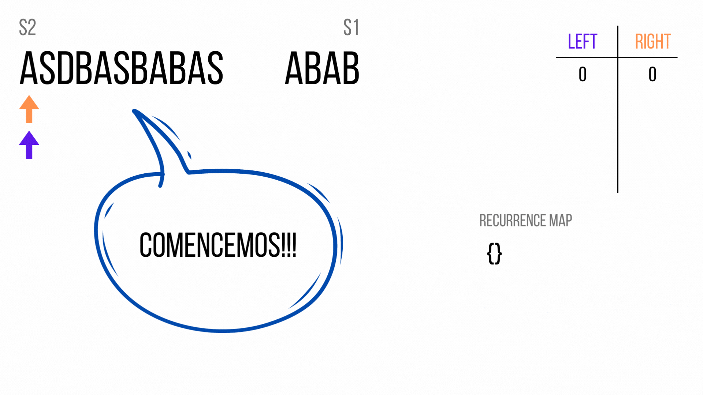

## Tabla de Contenidos
- [Introducción](#introducción)
- [Descripción del Problema](#descripción-del-problema)
- [Solución Inicial](#solución-inicial)
- [Follow up 1](#follow-up-1)
- [Follow up 2](#follow-up-2)
- [Conclusión](#conclusión)
- [Aprendizajes y Reflexiones](#aprendizajes-y-reflexiones)
- [Recursos](#recursos)

## Introducción
Este post me ilusiona mucho debido a que vamos a explorar un ejercicio tipo entrevista técnica. Es decir que vamos a tratar de dar una solución a un problema inicial, pero después vamos a enfrentarnos a dos variaciones al problema. Conforme vamos avanzado, la dificultad de los problemas sigue avanzando.

Comenzemos!!!

## Descripción del Problema
La descripción del problema es el siguiente:

> Tenemos dos strings `s1` y `s2`. Tenemos que crear una función que determina si `s2` es anagrama de `s1`.  
Nota: Anagrama es una palabra o frase formado reordenando las letras de otra, típicamente usando todas las letras exactamente una vez.

## Solución Inicial

El problema explica que un string es anagrama siempre sea el mismo texto pero reodenado. Cómo comprabamos esa condición de manera computacional? Para mí, esto se da si se cumplen los siguientes dos requisitos:

* Los dos strings deben tener la misma dimensión.
* Cada letra presente en el un string, de formar parte del otro.

Para poder evaluar estos dos requisitos les propongo la siguiente solución:

1. Crear un hash map que almacene la recurrencia que tiene cada letra en el string `s2`. Ejemplo: Para `abba`, el hash map sería: `{a: 2, b: 2}`.
2. De ahí recorremos el siguiente string, por cada letra verificamos si la letra está en el hash map y si existe letras no utilizadas. Si alguna letra no existe o ya se han utilizado todos los caracteres devolvemos falso.
3. Si hemos podido recorrer todo el arreglo retornamos verdadero dado que hemos cumplido los requisitos.

La implementación en javascript sería la siguiente:

```javascript
const toRecurrenceMap = (string) => {
  let map = {};

  for (let character of string) {
    if (!(character in map)) {
      map[character] = 0
    }
    map[character]++
  }

  return map;
}

const isAnagram = (s1, s2) => {
  if (s1.length !== s2.length) return false;

  const recurrenceS1Map = toRecurrenceMap(s1);

  for (let character of s2) {
    if (character in recurrenceS1Map && recurrenceS1Map[character] !== 0) {
      recurrenceS1Map[character]--;
    } else {
      return false;
    }
  }
  return true;
}
```
___Nota__: En la solución presentada hemos decidido crear una función auxiliar para la creación del mapa de curerrencias_.

Haciendo el analisis de complejidad de tiempo vemos que la creación del mapa de recurrencias es igual a $O(n)$ y verificar que los requisitos de anagram se cumplan es igualmente $O(n)$. Entonces $O(n) + O(n) = 2 * O(n) = O(n)$.

___Nota__: Por qué utilizamos $O(n) si son dos string diferentes? La respuesta es que lo primero que verificamos es que el tamaño de los strings sea el mismo._

Para este ejercicio estamos usando espacio extra para crear el hash map, el cual en el peor escenario tiene todos los elementos del string. Por esta razón la complejidad del tiempo es $O(n)$.

Resumiendo:

* Tiempo = $O(n)$   
* Espacio = $O(n)$

## Follow up 1

Revisemos ahora la primera variación a este problema. La descripción es la siguiente:

> Ahora tenemos que identificar si existe un substring en el anagrama en `s2` del string `s1`.

Esta variación viene con el siguiente ejemplo:

```
Entrada: s1: abc y s2: klmbcadfe
Salida: true
Explicación: En s2 el substring "bca" es anagrama de s1
```

Analizemos bien el problema. En este momento lo que tenemos que determinar es que si existe un anagrama de `s1` que sea un substring de `s2`.

El primer punto es que la condición que manejabamos en la solución cambia, ahora `s1` puede ser menor o igual a `s2`. Lo que nos indica que los retos que vamos a tener que sortear son 2: a) Construir el substring b) Verificar que el substring sea un anagrama.

Una primera aproximación, muy ingenua, puede ser la de construir todos los substring posibles por cada caracter y luego compararlo. Sin embargo la complejidad de tiempo se dispara, debido a que si `n` es el tamaño de `s1`, nuestra complejidad sería $O(n^n)$ o $O(n!)$ (Preguntar). Lo que es muy ineficiente. Probemos ahora otra solución,

Qué estrategia existe que me permite construir o comparar datos de un array sin la necesidad de loops anidados? Tenemos la solución de dos punteros

Entonces lo que podriamos hacer es tener dos punteros con los cuales puedo construir mi mapa de recurrencias. Primero muevo el puntero de la derecha para construir el mapa de recurrencias inicial. Una vez estó este hecho, es decir que el puntero se encuentre en la posición `n-1` y que no se haya cumplido la condición, comienzo a mover el puntero de la izquierda para eliminar elementos del arreglo y el de la derecha para añadir nuevos. De esta manera tengo actualizado el array de recurrencias que tiene los valores para verificar si el substring es anagrama. Veamoslo con un ejemplo:



Si obvservamos bien el ejemplo se nos viene una pregunta: ¿Cómo verificamos que el mapa de recurrencias forma al string `s1`? Para nosotros es fácil a la vista pero computacionalmente cómo lo hacemos.

Una solución puede ser generar un mapa de recurrencias para `s1` tambien y comparar los dos objetos. Pero eso significaría que para cada elemento desde que comenzamos a mover `left` Tenemos que recorrer los dos objectos, lo que mínimo nos da un complejidad de $O(n)$, si movernos por el array es $O(m)$ siendo `m` el tamaño de `s2` nos da que la complejidad del arreglo es $O(n*m)$. Podemos lograr una complejidad lineal?

Si regresamos a ver el problema base vemos que las condiciones que tenemos que cumplir para comprobar que un `string` es anagram de otro son:

1. Todas las letras del string se encuentran en el otro.
2. Cada letra se encuentra el mismo número de veces en el otro string.

Entonces que tal si hacemos lo siguiente:

1. Hacemos un recurrenceMap del `s1`.
2. Movemos el puntero `right` como en la solución anterior pero en con la diferencia de que cada vez que analizamos un elemento comprobamos si el elemento está en el recurrenceMap y si existen elementos disponibles restamos el valor cómo en el ejercicio 1. Si no está el valor solamente pasamos.
3. Si `right - left` ya es igual al tamaño de `s1`, comenzamos a mover `left`, pero esta vez cada valor de left que esté en el recurrenceMap le sumamos uno, porque significa que no es parte del subarray respuesta. 
4. A la par tenemos una variable que se llamé `toUseChars` que tiene la longitud de `s1`. Ese valor la vamos restando cada vez que un elemento esté en el recurrenceMap y el valor sea mayor de 0.
5. Verificamos que `toUseChars` sea igual a 0, si es así retornamos `true`. Si hemos recorrido todo `s2` y eso no ha pasado retornamos `false`.

Igual que en el caso anterior, entendámoslo mejor con un ejemplo:


La implementación sería la siguiente:

```javascript
const isThereAnAnagram = (s1, s2) => {
  const recurrenceS1Map = toRecurrenceMap(s1);

  let leftIdx = 0;
  let rightIdx = 0;
  let toUseChars = s1.length;

  while (rightIdx < s1.length) {
    const character = s2[rightIdx];
    if (character in recurrenceS1Map) {
      recurrenceS1Map[character]--;
      if (recurrenceS1Map[character] >= 0) {
        toUseChars--;
      }
    }
    rightIdx++;
  }

  if (toUseChars === 0) return true;

  while (rightIdx < s2.length) {
    const toLeaveChar = s2[leftIdx];
    if (toLeaveChar in recurrenceS1Map) {
      recurrenceS1Map[toLeaveChar]++;
      if (recurrenceS1Map[toLeaveChar] > 0) {
        toUseChars++;
      }
    }
    leftIdx++;

    const toEnterChar = s2[rightIdx];
    if (toEnterChar in recurrenceS1Map) {
      recurrenceS1Map[toEnterChar]--;
      if (recurrenceS1Map[toEnterChar] >= 0) {
        toUseChars--;
      }
    }
    rightIdx++;


    if (toUseChars === 0) return true;
  }

  return false;
}

console.log(isThereAnAnagram('abc', 'klmbcadfe')); // true
console.log(isThereAnAnagram('abc', 'klmbdcadfe')); // false
console.log(isThereAnAnagram('abc', 'klmbbcadfe')); // true
console.log(isThereAnAnagram('abc', 'klmbbclavbcadfe')); // true
console.log(isThereAnAnagram('abab', 'asdbasbabas')); // true
console.log(isThereAnAnagram('ab', 'bbbab')); // true
console.log(isThereAnAnagram('abc', 'bbbab')); // false
```

Si hacemos el análisis de complejidad del algoritmo vemos que recorremos un máximo de 2 veces cada elemento, lo que me da una complejidad de tiempo igual a $O(2*n)$ lo que es igual a $O(n)$. En el caso del espacio creamos un mapa de recurrencias basado en `s1`, que en el peor de los casos (cada letra es elemento) sería igual a $O(n)$.

Entonces el análisis es el siguiente:
* Tiempo = $O(n)$
* Espacio = $O(n)$

Vamos al último ejercicio :D.

## Follow up 2
El enunciado es el siguiente:

> Ahora ya no tenemos un `s1` sino un arreglo de strings `arr`. Cómo podemos determinar si existe un substring en `s2` que es una permutación de todos los strings de `arr`.

Los ejemplos que nos da el problema son los siguientes:

```
// Ejemplo 1:
Entrada: arr: [abc, def, ghi] y s2 = defghiabc
Salida: Verdadero
Explicación: El substring `defghiabc` contiene `def`, `ghi` y `abc` que son los strings de arr.

// Ejemplo 2:
Entrada: arr: [abc, def, ghi] y s2 = defghiabc
Salida: Falso
Explicación: El substring `defighcba` solo tiene al string `def` de arr.

// Ejemplo 3:
Entrada: arr: [abc, def, ghi] y s2 = lmnabcghidefo
Salida: Verdader
Explicación: El substring `abcghidef` contiene `abc`, `ghi`, `def` que son los strings de arr.


```

## Conclusión

## Aprendizajes y Reflexiones

## Recursos
