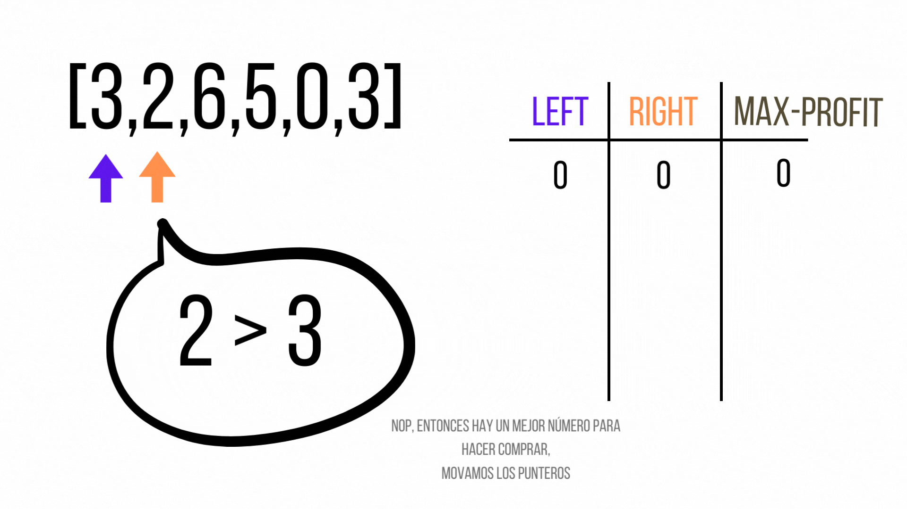

## Tabla de Contenidos
- [Introducción](#introducción)
- [Descripción del Problema](#descripción-del-problema)
- [Solución Fuerza Bruta](#solución-fuerza-bruta)
- [Intentos aplicando solución 2 punteros](#intentos-aplicando-solución-2-punteros)
- [Solución correcta](#solución-correcta)
- [Conclusión](#conclusión)
- [Aprendizajes y Reflexiones](#aprendizajes-y-reflexiones)
- [Recursos](#recursos)


## Introducción
Nos encontramos en un nuevo post relacionado a resolver problemas de código. En este caso me gustaría que exploráramos juntos el problema "Best Time to Buy and Sell Stock". Me gustaría hacer un especial énfasis en los errores que uno puede cometer al enfrentar este problema. Empezemos!!!

## Descripción del Problema
La descripción en LeetCode es la siguiente:

> Dado un arreglo de precios que corresponden al valor de un stock en un día. Necesitamos maximizar la ganancia que se tiene al comprar un stock en un día y venderlo en otro día en el futuro.

El ejemplo viene con los siguientes casos de prueba.

```
Ejemplo 
Entrada: [7,1,5,3,6,4]
Salida: 5
Explicación: Valor es igual a 5. De comprar en el día 2 
(valor 1) y vender en el día 5 (valor 6).

Entrada: [7,6,4,3,1]
Salida: 0
Explicación: En este caso no existe ningún par de 
entradas nos devuelve un max profit.
```
## Solución Fuerza Bruta
La primera solución de la cual me gustaría partir es la de fuerza bruta. Es decir, calcular todos los posibles profits que podemos obtener. Para ello nos apoyamos de dos loops anidados.

La implementación sería la siguiente:

```javascript
const maxProfit = (prices) => {
  let maxProfit = 0;

  for (let i=0; i < prices.length - 1; i++) {
    for (let j=i+1; j < prices.length; j++) {
      maxProfit = Math.max(maxProfit, prices[j] - prices[i]);
    }
  }
  return maxProfit
}

console.log(maxProfit([7, 1, 5, 3, 6, 4])) // 5
console.log(maxProfit([7, 6, 4, 3, 1])) // 0
console.log(maxProfit([1, 4, 2])) // 3
console.log(maxProfit([3, 2, 6, 5, 0, 3])) // 4
```

Si hacemos un análisis de complejidad de tiempo, vemos que por cada valor recorremos en el peor de los casos todos los elementos menos ese. Entonces la complejidad de tiempo es $O(n^2)$. Por otro lado, la complejidad de tiempo es $O(1)$ dado que no estamos usando espacio extra más allá de la variable `maxProfit`.

Esta solución es correcta, pero al tener una complejidad cuadrática ya nos hace ruido. Podemos obtener una solución mejor. Claro que sí!!!

## Intentos aplicando solución 2 punteros
En este post en especial me gustaría que exploraramos dos soluciones que pasan los casos de prueba, pero que fallan en algunos `edge cases` al no considerar ciertos escenarios. Considero que esto puede ayudarnos a visualizar errores comunes que cometemos al enfrentarnos a este tipo de problemas.

### Primer Intento
La primera idea que se nos puede venir a la mente, me pasó a mí, es pensar que el problema lo que busca en el fondo es determinar el valor mínimo y máximo del arreglo, siendo estos obviamente los que me pueden ofrecer el mayor profit.

La implementació sería la siguientes:

```javascript
const maxProfit2 = prices => {
  let minValue = Infinity;
  let maxValue = -Infinity;
  
  for (let i=0; i < prices.length; i++) {
    minValue = Math.min(prices[i], minValue);
    maxValue = Math.max(prices[i], maxValue);
  }

  return maxValue - minValue;
}
```

Ok! La solución __no funciona__ pero hay una buena idea detrás, necesitamos determinar valores máximos y mínimos. Sin embargo problema con esta solución es que por ejemplo para una de nuestras entradas de prueba: `[7, 1, 5, 3, 6, 4]`, el valor mínimo es 1 y el máximo 7, en consequencia el máximo profit sería 6. El problema aquí es que estamos obviando una condición del problema: `Vender el stock en un día y venderlo en el futuro`. En este caso el valor de venta (pos 0) se encuentra un día antes del valor de venta (pos 1). 

Probemos otra idea.

### Segundo Intento

Al momento de leer el ejercicio, se me vino a la mente que la manera de resolverlo es enfocarlo utilizando la estratégia "dos índices".

Tenemos que tomar en cuenta que siempre el valor de compra tiene que estar antes que el valor de venta. Ahora mi idea fué empezar los punteros por la izquierda y otro por la derecha, de tal manera que voy moviendo mi puntero desde los extremos en la búsqueda de los valores mínimos y máximos.

La implementación sería la siguiente:

```javascript
const maxProfit = prices => {
  let idxLeft = 0;
  let idxRight = prices.length - 1;

  let buyValue = Infinity;
  let sellValue = -Infinity;

  while (idxLeft < idxRight) {
      buyValue = Math.min(prices[idxLeft], buyValue);
      sellValue = Math.max(prices[idxRight], sellValue);

      idxLeft++;
      idxRight--;
  }
  return Math.max(sellValue - buyValue, 0);
}

console.log(maxProfit([7, 1, 5, 3, 6, 4])) // 5
console.log(maxProfit([7, 6, 4, 3, 1])) // 0
console.log(maxProfit([1, 4, 2])) // 3
console.log(maxProfit([3, 2, 6, 5, 0, 3])) // 4
```

Si evaluas la función, esta pasa los 2 primeros casos de prueba pero falla en los siguientes. Por qué? Si vemos la solución, asumimos que los valores minimos van a estar en la parte izquierda del arreglo y los máximos en la derecha, pero eso no es verdad. 

La función tiene dos problemas:

1. Si existe un arreglo de tamaño impar, el elemento de la mitad no se evalua.
2. Si los datos de la solución están solo a un lado del arreglo, esta solución jamás va a evaluarlos.

Pero igual que en el primer intento, este solución nos da otra pista acerca del resultado, podemos utilizar una solución de dos punteros.

Utilizando estos dos conceptos, analizemos la solución correcta.

## Solución correcta
Los dos intentos, si bien fallidos, nos dejaron tres lecciones:

* Necesitamos buscar un valor mínimo y máximo pero que cumpla la restricción.
* Podemos aplicar una solución de dos punteros.
* Necesitamos encontrar la forma correcta de mover los dos punteros.

Ya intentamos ubicar los índices al inicio y al final, pero ahí obviamos algunas soluciones. Lo que necesitamos es asegurar que el valor de venta está después del valor de compra. Entonces probemos lo siguiente:

1. Ubiquemos nuestros índices: leftIdx en el primer elemento y rightIdx en el segundo elemento.
2. Evaluamos si el valor que está en la posición `rightIdx` es mayor al valor que está en la posición del `leftIdx`. Si es el caso, significa que estamos generando profit, entonces guardamos el valor cómo `maxProfit` y movemos el puntero `rightIdx` a la derecha para ver si podemos encontrar un mejor profit.
3. Caso contrario, si `rightIdx` es menor significa dos cosas, que no vamos a generar profits con esos valores y que existe un valor mas pequeño con el que podriamos generar mejores profits, entonces movemos `leftIdx` hasta dónde está `rightIdx` y este puntero un valor más adelante.
4. Repetimos este proceso hasta leer todos los elementos del arreglo.

Si nos les queda muy claro, veamoslo con el siguiente ejemplo:



La implementación en javascript sería la siguiente:

```javascript
const maxProfit = prices => {
  let idxLeft = 0;
  let idxRight = 1;
  let maxProfit = 0;

  while (idxRight < prices.length) {
    if (prices[idxRight] < prices[idxLeft]) {
      idxLeft = idxRight;
    } else {
      const currentProfit = prices[idxRight] - prices[idxLeft];
      maxProfit = Math.max(currentProfit, maxProfit);
    }
    idxRight++;
  }
  return maxProfit
}

console.log(maxProfit([7, 1, 5, 3, 6, 4])) // 5
console.log(maxProfit([7, 6, 4, 3, 1])) // 0
console.log(maxProfit([1, 4, 2])) // 3
console.log(maxProfit([3, 2, 6, 5, 0, 3])) // 4
```

Si hacemos un análisis de complejidad de tiempo vemos que la solución exige que nos movamos máximo dos veces por cada elemento, lo que sería $O(2n)$, simplificando se convierte a $O(n)$. La complejidad de tiempo se mantiene constante.

## Conclusión
El camino para resolver un problema exige que probemos muchas opciones, cada una de ellas nos va acercar a la solución correcta. En nuestro caso, la decisión de usar la solución de dos punteros era la correcta pero su implementación no era adecuado.

## Aprendizajes y Reflexiones
* Una solución del tipo "dos punteros" puede ayudarnos a simplificar una solución de cuadrática a lineal.
* No siempre vas a llegar a la solución a la primera, no te rindas.

## Recursos
1. https://leetcode.com/problems/best-time-to-buy-and-sell-stock/
2. https://leetcode.com/problems/best-time-to-buy-and-sell-stock/solutions/1735550/python-javascript-easy-solution-with-very-clear-explanation/

