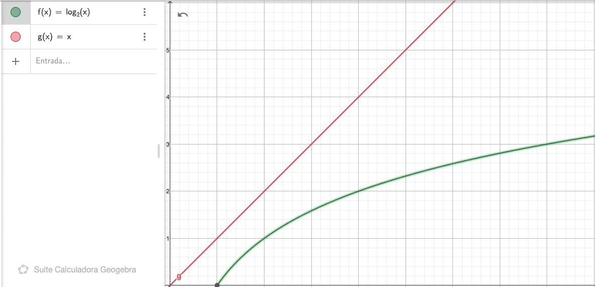

# Tabla de Contenidos
- [Introducción](#introducción)
- [Binary Search](#binary-search)
- [Función Bisect](#función-bisect)
- [Bisect Left y Bisect Right](#bisect-left-y-bisect-right)
- [Dónde se aplica?](#dónde-se-aplica-?)
- [Conclusión](#conclusión)
- [Recursos](#recursos)

## Introducción
Trabajando en un ejercicio de algoritmos me encontré con la siguiente situación: Necesitaba determinar si dentro de un arreglo de posiciones de un caracter dentro de un string, existia un valor después de una posición dada. Ejemplo:

```javascript
// Existe un caracter "a" en el string después de la posición 4?
const string = 'aaabbabc'
const aPos = [0,1,2,5]
const targetPosition = 4
```

Una manera sencilla de resolver este problema es la siguiente:

1. Iterar a través del arreglo
2. Comparar si el número es menor que el valor que se busca.

    2.1.  Si es menor avanzar al siguiente número

    2.2.  Si es igual retornar la siguiente posición. Si la siguiente posición es mayor o igual al tamaño del arreglo retornar -1

    2.3   Si es mayor retornar la actual posición.

3. Si se itera todo el arreglo, significa que no existe esa posición, entonces retornar -1.

Aquí esta la implementación

```javascript
const getNextPositionAfter = (positions, targetPosition) => {
  for (let pos of positions) {
    if (pos === targetPosition) {
      return pos + 1 < positions.length ? pos + 1 : -1;
    } else if (pos > targetPosition) {
      return pos;
    }
  }
  return -1;
}

console.log(getNextPositionAfter([0, 1, 2, 5], 4)); // 5
console.log(getNextPositionAfter([0, 1, 2, 5], 7)); // -1
console.log(getNextPositionAfter([0, 1, 2, 5], 1)); // 2
console.log(getNextPositionAfter([0, 1, 2, 5], 5)); // -1
```

Si analizamos la función vemos que la complejidad de tiempo es $O(n)$. Y he aquí la pregunta de siempre, lo podemos hacer mejor? Pues si, de hecho estamos obviando una caracteristica importante del arreglo, está __ordenado__. Eso significa que podemos intentar aplicar Binary Search o algún algoritmo similar a este.

## Binary Search

Recordemos brevemente la definición del algoritmo Binary Search.

> El algoritmo de búsqueda Binary Search define que dentro de un arreglo de datos ordenados, podemos analizar el elemento de la mitad, si es el elemento que busco retorno su índice, caso contrario verifico si el valor de la mitad es menor al elemento que busco. Si la sentencia es verdera descarto de mi busqueda el lado derecho, si es falsa el lado izquierdo de mi arreglo. Y así hasta encontrar mi valor o quedarme sin elementos por analizar. Su complejidad es $O(log n)$. Mira más información [aquí](https://www.geeksforgeeks.org/binary-search/).

Su implementación sería la siguiente:

```javascript
const binarySearch = (array, target) => {
  let startIdx = 0;
  let endIdx = array.length;

  while (startIdx < endIdx) {
    const midIdx = startIdx + Math.floor((endIdx - startIdx) / 2);
    const midValue = array[midIdx]

    if (target === midValue) {
      return midIdx;
    } else if (target < midValue) {
      endIdx = midValue;
    } else {
      startIdx = midValue + 1;
    }
  }

  return -1;
}

console.log(binarySearch([0, 1, 2, 5], 2)); // 2
console.log(binarySearch([0, 1, 2, 5], 5)); // 3
console.log(binarySearch([0, 1, 2, 5], 7)); // -1
console.log(binarySearch([0, 1, 2, 5], 4)); // -1
```

Podemos aplicar Binary Search a nuestro problema inicial? La respuesta es no ... todavía.
Nuestro problema exige no solamente que encontremos un valor, sino que retornemos la posición siguiente a un valor dado.
Si puedo plantear el problema en otras palabras puedo decir que lo que buscamos es:

> Encontrar la posición en la que podemos insertar un elemento dado de tal manera que la lista siga ordenada.

Bajo esta premisa, me encontre que existe una función en Python que hace precisamente esto y esta basada en Binary Search.

## Función Bisect

Si vamos a la documentación de Python nos indica lo siguiente acerca de bisect.

> Bisect provee un soporte para mantener listas ordenadas sin la necesidad de hacer un reordenamiento después de un inserción.
Mas información [aquí](https://docs.python.org/3/library/bisect.html#module-bisect)

Veamos a continuación cómo funciona:

```python
from bisect import bisect

print(bisect([0, 1, 2, 5], 4)) # 3
print(bisect([0, 1, 2, 5], 5)) # 4
print(bisect([0, 1, 2, 5], 1)) # 2
print(bisect([0, 1, 2, 5], 7)) # 4
print(bisect([0, 1, 2, 5], -1)) # 0
```

Si analizamos las salidas podemos concluir lo siguiente:

* Si encuentra que el elemento es mayor o igual al valor que está analizando, devuelve su valor + 1, para mantener la lista ordenada
* Si el elemento es mayor el último valor del arreglo, retorna cómo indice el tamaño del arreglo
* Si el elemento es menor al primer valor del arreglo, retorna 0 cómo índice.

Cabe destacar que cuando el elemento está en la lista, no necesariamente debe devolverse el índice a la derecha, también puede ser el índice a la izquierda. Es por ello que Python define otras dos funciones denominadas `bisect_left` y `bisect_right`. Por defecto `bisect` funciona cómo `bisect_right`.

Lamentablemente estas funciones no están implementadas en Javascript, por lo que procedemos a hacer nuestra propia implementación usando cómo base la función Binary Search. Empezemos con `bisect_right`.

### Bisect Right

Si observamos bien la función Binary Search, lo que hace es acortar el rango de valores a analizar moviendo valores por la izquierda y la derecha. Esta acción produce que si el valor no se encuentra presente en la lista, el valor de `startIdx` va a ser el índice dónde debería estar ese valor.

Ejemplo.

1. Tomemos el arreglo [0, 1, 2, 5] y digamos que debemos insertar el valor 4;
2. Analizemos cómo se compartaría binary search.

|startIdx | endIdx | midIdx | midValue|
|---------|--------|--------|---------|
|    0    |    4   |   2    |    2    |
|    3    |    4   |   3    |    5    |
|    3    |    3   |   -    |    -    |
3. La respuesta sería falso.

Sin embargo `startIdx` (`endIdx` también) tiene el índice dónde debería estar 4, que es la posición 3. Esto es justamente lo que necesitamos para implementar bisect_right usando binary search.

Haciendo algunos cambios al algoritmo inicial, el resultado que tenemos es el siguiente.

```javascript
const bisectRight = (array, target) => {
  let startIdx = 0;
  let endIdx = array.length;

  while (startIdx < endIdx) {
    const midIdx = startIdx + Math.floor((endIdx - startIdx) / 2);
    const midValue = array[midIdx]

    if (target < midValue) {
      endIdx = midIdx;
    } else {
      startIdx = midIdx + 1;
    }
  }

  return startIdx;
}

console.log(bisectRight([0, 1, 2, 5], 4)) // 3
console.log(bisectRight([0, 1, 2, 5], 5)) // 4
console.log(bisectRight([0, 1, 2, 5], 1)) // 2
console.log(bisectRight([0, 1, 2, 5], 7)) // 4
console.log(bisectRight([0, 1, 2, 5], -1)) // 0
```

Cómo se ve en el código, ya no tenemos la sentencia para verificar si el valor se encuentra en el arreglo. Lo que tratamos es forzar que el startIdx nos indique la posición en la que debería estar un valor dado en el arreglo.

Qué pasa si el valor está en el arreglo? Pues cómo se ve la sección `else` del algoritmo, el índice retornado será el de la derecha ` startIdx = midIdx + 1;`.

### Bisect Left

Ahora que pasa si lo que nos piden es devolver el índice a la izquierda del valor dado. Simple, evitamos que si el valor se encuentra en el arreglo se aumente el índice en 1, para ello hacemos el siguiente cambio en el algoritmo: `if (target <= midValue)` de tal modo que el resultado sería el siguiente:

```javascript
const bisectLeft = (array, target) => {
  let startIdx = 0;
  let endIdx = array.length;

  while (startIdx < endIdx) {
    const midIdx = startIdx + Math.floor((endIdx - startIdx) / 2);
    const midValue = array[midIdx]

    if (target <= midValue) {
      endIdx = midIdx;
    } else {
      startIdx = midIdx + 1;
    }
  }

  return startIdx;
}

console.log(bisectLeft([0, 1, 2, 5], 4)) // 3
console.log(bisectLeft([0, 1, 2, 5], 5)) // 3
console.log(bisectLeft([0, 1, 2, 5], 1)) // 1
console.log(bisectLeft([0, 1, 2, 5], 7)) // 4
console.log(bisectLeft([0, 1, 2, 5], -1)) // 0
```

## Aplicando Bisect
Cool!! Ahora que tenemos claro cómo funciona bisect, apliquemoslo a nuestro problema inicial.

```javascript
// Existe un caracter "a" en el string después de la posición 4?
const string = 'aaabbabc'
const aPos = [0,1,2,5]
const targetPosition = 4
```

El algoritmo sería el siguiente:

```javascript
const getNextPositionAfter = (positions, targetPosition) => {
  const nextIdx = bisectRight(positions, targetPosition);

  if (nextIdx === positions.length) {
     return -1;
  }
  return positions[nextIdx];
}

console.log(getNextPositionAfter([0, 1, 2, 5], 4)); // 5
console.log(getNextPositionAfter([0, 1, 2, 5], 7)); // -1
console.log(getNextPositionAfter([0, 1, 2, 5], 1)); // 2
console.log(getNextPositionAfter([0, 1, 2, 5], 5)); // -1

// Aquí debería estar implementado bisectRight
```

Boom!!! Tenemos una nueva solución para nuestro problema inicial el cual tiene una complejidad de tiempo de $O(log n)$ que es mucho mejor a $O(n)$ cómo se puede ver en la siguiente gráfica.



## Conclusión
1. La función bisect nos permite identificar la posición en la que debería ir un valor si fuera agregado a una lista.
2. Siempre debemos estar atentos a los datos ocultos de un problema, en este caso el saber que el arreglo es ordenado nos permitió aplicar bisect que redujo la complejidad de nuestro problema significativamente.
3. Si una función no está implementada en tu lenguaje, siempre puedes implementarla tú :D.

## Recursos
1. Binary Search: https://www.geeksforgeeks.org/binary-search/
2. Documentación acerca de Bisect en Python: https://docs.python.org/3/library/bisect.html#module-bisect
