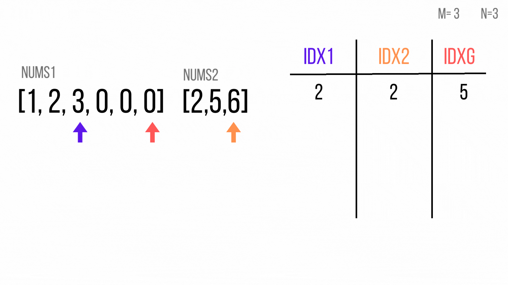

## Tabla de Contenidos
- [Introducción](#introducción)
- [Descripción del Problema](#descripción-del-problema)
- [Función para test](#función-para-test)
- [Solución Dos Índices](#solución-dos-índices)
- [Optimización Solución Dos Índices](#optimización-solución-dos-índices)
- [Solución sin espacio extra](#solución-sin-espacio-extra)
- [Conclusión](#conclusión)
- [Aprendizajes y Reflexiones](#aprendizajes-y-reflexiones)
- [Recursos](#recursos)

## Introducción

En esta ocasión, mas allá de presentarles las soluciones a este problema, que de por si es sencillo. Me gustaría compartir con ustedes el viaje que recorrí para poder darle una respuesta a este problema.

Considero que es importante porque en mi afán de dar una solución rápida, obvié algunos detalles del problema que me hubieran permitido encontrar la solución óptima sin ningún contratiempo.

Espero que mi experiencia les ayude para no cometer los mismos errores. Comenzemos.

## Descripción del problema

La descripción del problema que tenemos es el siguiente:

> Tenemos dos arreglos de números enteros, nums1 y nums2, los cuales se encuentran ordenados de manera ascendente. Además de dos enteros, m y n, que representan el número de elementos de num1 y num2. Combina los dos arreglos en un solo arreglo ascendente.
<br><br>
Nota: La función no debe retornar el arreglo resultante. Este debe almancenado en nums1, el cual tiene una dimensión de m + n, y los espacios no utilizados han sido rellenados con 0.

Los ejemplos provistos son los siguientes.

```
// Ejemplo 1
Entrada: nums1 = [1,2,3,0,0,0], m = 3, nums2 = [2,5,6], n = 3
Salida: [1,2,2,3,5,6]

// Ejemplo 2
Entrada: nums1 = [1], m = 1, nums2 = [], n = 0
Salida: [1]

// Ejemplo 3
Entrada: nums1 = [0], m = 0, nums2 = [1], n = 1
Salida: [1]
```
## Función para test
Dado que la función requiere de una cantidad considerable de argumentos y que necesito evaluar el valor de `nums1` por cada entrada y no el valor de retorno de la función, que tal si creamos una función que nos ayude a correr todos los casos de prueba.

Les propongo la siguiente:

```javascript
const testCases = [
  {
    nums1: [1, 2, 3, 0, 0, 0],
    m: 3,
    nums2: [2, 5, 6],
    n: 3,
  },
  {
    nums1: [1],
    m: 1,
    nums2: [],
    n: 0,
  },
  {
    nums1: [],
    m: 0,
    nums2: [1],
    n: 1,
  },
];

const testFunction = (testedFunction) => {
  testCases.forEach(argsFn => {
    testedFunction(...Object.values(argsFn));
    console.log(argsFn.nums1);
  })
}
```

Lo primero que hacemos es definir un arreglo con las diferentes entradas que queremos probar, en este caso 3. 

Nuestra función recibe de parámetro la función a evaluar, y la ejecuta a cada conjunto de entradas del test cases. 

Ten en cuenta esta función que es la que vamos a estar utilizando de aquí en adelante.

Volvamos al ejercicio.

## Solución Dos Índices

La primera idea que se me vino a la mente fue la acercarme al ejercicio obviando el hecho de que la construcción del nuevo arreglo debe darse sobre `nums1`, decidí usar un arreglo temporal.

Con esto en mente es fácil resolver este problema usando 2 índices, uno por cada arreglo. Cada índice empieza en la posición inicial del arreglo, comparo los valores correspondientes a esos índicies. Si el valor actula de `nums1` es menor que el de `nums2` entonces añado ese valor a mi arreglo y aumento el valor de su índice; caso contrario realizo el mismo proceso pero con el valor de `nums2`;

Este proceso lo repito mientas que los índices sean menores a los elementos de los arreglos, valor representado en `m` y `n`. Al final uno de los índices no habrá recorrido los valores de su arreglo, por lo que con una condición determino que arreglo es y agrego los valores faltantes a mi arreglo temporal.

Finalmente, reemplazo los valores de `tempArray` en `nums1`.

La implementación en Javascript de esta solución sería la siguiente:


```javascript
const merge = (nums1, m, nums2, n) => {
  let nums1Idx = 0
  let nums2Idx = 0
  const temArray = []

  while (nums1Idx < m && nums2Idx < n) {
    const num1 = nums1[nums1Idx];  
    const num2 = nums2[nums2Idx];

    if (num1 < num2) {
      temArray.push(num1);
      nums1Idx++;
    } else {
      temArray.push(num2);
      nums2Idx++;
    }
  }

  if (nums1Idx < m) {
    for (let i = nums1Idx; i < m; i++) {
      temArray.push(nums1[i]);
    }
  } else {
    for (let i = nums2Idx; i < n; i++) {
      temArray.push(nums2[i]);
    }
  }

  for (let i=0; i < temArray.length; i++) {
    nums1[i] = temArray[i];
  }
}

// No olvides definir previamente esta función.
testFunction(merge);
```

Si hacemos el análisis de complejidad de tiempo observamos que los primeros dos loops (while y for) nos indican que recorremos todos los elementos de m y n. Por lo cual la complejidad de esa sección es $O(n + m)$. El for que utilizamos para sobreescribir el valor de `nums1` tiene el tamaño de $O(n + m)$ por lo que esa sección tiene una complejidad de $O(n+m)$, entonces el resultado es el siguiente $T = O(n+m) + O(n+m) = 2*O(n+m) = O(n+m)$.

Por otro lado, estamos creando un arreglo del tamaño $O(n+m)$ por lo que la complejidad de espacio sería $O(n+m)$.

La pregunta es la siguiente, lo podemos hacer mejor? Miremos la siguiente sección.

## Optimización Solución Dos Índices

Si vemos la complejidad de tiempo de la solución anterior $O(n+m)$, llegamos a la conclusión que la solución más óptima. Necesitamos recorrer al menos una vez en los elementos de cada array. Entonces qué podemos optimizar? El espacio.

En la primera solución tenemos igualmente una complejidad de espacio $O(n+m)$. Pero necesito crear un arreglo de tamaño $n+m$, que tal si solo copio los valores de `nums1` a un nuevo arreglo y guardo los cambios directamente en él.

La implementación sería la siguiente:

```javascript
const merge = (nums1, m, nums2, n) => { 
  let nums1Idx = 0;
  let nums2Idx = 0;
  let counter = 0;
  const tempNums1 = nums1.slice(0, m);

  while (nums1Idx < m && nums2Idx < n) {
    const num1 = tempNums1[nums1Idx];
    const num2 = nums2[nums2Idx];
    
    if (num1 < num2) {
      nums1[counter] = num1;
      nums1Idx++;
    } else {
      nums1[counter] = num2;
      nums2Idx++;
    }
    counter++;
  }

  if (nums1Idx < m) {
    for (let i = nums1Idx; i < m; i++) {
      const num = tempNums1[i];
      nums1[counter] = num;
      counter++;
    }
  } else {
    for (let i = nums2Idx; i < n; i++) {
      const num = nums2[i];
      nums1[counter] = num;
      counter++
    }
  }
}

// No olvides definir previamente esta función.
testFunction(merge);
```

Si observamos bien esta solución, la estructura inicial se mantiente en gran medida. Tenemos los dos loops para recorrer todos los elementos de los 2 arrays. Sin embargo, el hecho de no utilizar un arreglo temporal para guardar los datos evita el tercer for loop. Por lo tanto la complejidad de espacio es directamente $O(n + m)$, sin simplificación. De manera teórica esto no significa una optimización pero de manera práctica siempre es bueno no recorrer los arreglos otra vez.

Ahora lo importante, en el análisis de espacio vemos que hemos creado un arreglo para guardar los valores válidos de `nums1` que es `m`. Por lo que la complejidad de espacio se reduce a $O(m)$. Esto ya significa una importante optimización.

Siempre viene esta pregunta, se puede hacer mejor? y en este caso viene acompañado de la pregunta que necesito optimizar? La respuesta es el tiempo. Será que logramos encontrar una solución que no necesite espacio extra? Pues sí, vamos a la siguiente solución.

## Solución sin espacio extra

Cómo ya lo he comentado en otros posts, es super importante tener en cuenta los datos ocultos en los problemas. En mi afán de resolver una solución del tipo `dos índices` me concentré mucho en ubicar los índices al inicio de los arreglos, situación por la cual necesitaba crear un arreglo temporal para poder manipular `nums1` directamente, evitando problemas.

Sin embargo analizemos por un momento una entrada de `nums1`: `[1, 2, 3, 0, 0, 0]`. El arreglo tienen la dimensión de `m+n`, y los `n` valores restantes son igual a `0`, es decir que si los remplazo no pasa nada. 

No los convenzco? Hagamos una prueba:



Cómo se puede ver en el gif, al momento de comenzar a construir el arreglo por el final se cuida la integridad de los elementos de `nums1`, si estos no están en una posición adecuado serán reubicados y su posición podra ser utilizada por otro elemento.

Veamos la implementación en javascript:

```javascript
const merge = (nums1, m, nums2, n) => {
  let nums1Idx = m - 1;
  let nums2Idx = n - 1 ;
  let numsId = m + n - 1;

  while (nums1Idx >= 0 && nums2Idx >= 0) {
    const num1 = nums1[nums1Idx];
    const num2 = nums2[nums2Idx];

    if (num1 > num2) {
      nums1[numsId] = num1;
      nums1Idx--;
    } else {
      nums1[numsId] = num2;
      nums2Idx--;
    }
    numsId--;
  }

  for (let i = nums2Idx; i >= 0; i--) {
    nums1[i] = nums2[i];
  }
}

testFunction(merge, testCases);
```

Si hacemos el análisis de complejidad de tiempo podemos observar que este se mantiene en $O(n+m)$, dado que necesitamos recorrer todos los elementos de los dos arrays.

Pero en el caso del análisis de tiempo nos encontramos que la complejidad es $O(1)$, dado que no necesitamos usar una estructura extra dónde guardar información más allá de las variables.

La idea detrás de esta solución no es complentamente mía. De hecho está inspirada en esta [solución](https://leetcode.com/problems/merge-sorted-array/solutions/3185732/merge-sorted-array-with-step-by-step-explanation/) publicada en LeetCode.

## Conclusión

Este blog presenta mi experiencia al momento de resolver el ejercicio "Merge Sorted Array". Si bien este ejercicio es sencillo, he decidido publicar todas las soluciones y no solo la óptima, debido a que considero que otras personas pueden identificarse con el proceso de partir de una respuesta no tan óptima y en base al análisis poder conseguir una mejor.

## Aprendizajes y Reflexiones

1. Nada está en un buen ejercicio por que sí, el hecho de que `nums1` tenga la dimensión del arreglo final y que los elementos extras sean 0, nos da una pista de cómo obtener la solución óptima.

2. No siempre las optimizaciones estan relacionadas con el tiempo, muchas veces la idea es encontrar que utilize la menor cantidad de espacio o de plano no lo utilize.

3. Siempre busca entender cómo funciona cada solución.

## Recursos
1. https://leetcode.com/problems/merge-sorted-array/description/
2. https://leetcode.com/problems/merge-sorted-array/solutions/3185732/merge-sorted-array-with-step-by-step-explanation/
