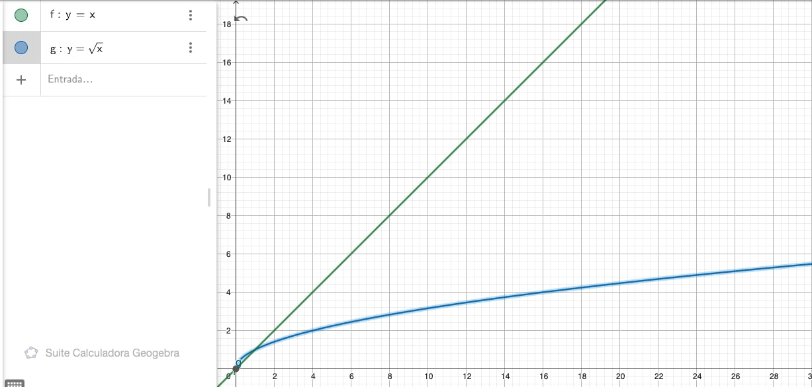

# Tabla de Contenidos
- [Introducción](#introducción)
- [Descripción del Problema](#descripción-del-problema)
- [Solución Ingenua](#solución-ingenua)
- [Solución Binary Search](#desarrollo-de-la-solución)
- [Solución Intervalos](#análisis-de-complejidad)
- [Versión generalizada](#pruebas-y-resultados)
- [Aprendizajes y Reflexiones](#aprendizajes-y-reflexiones)
- [Conclusión](#conclusión)
- [Recursos](#recursos)
- [Sobre el Autor](#sobre-el-autor)

## Introducción
Últimamente me he encontrado muy interesado en profundizar mi conocimiento en algoritmos y estructura de datos, además de mejorar mis habilidades en la resolución de problemas de este tipo. Por lo que como parte del curso [The Last Algorithms Course You'll Need](https://frontendmasters.com/courses/algorithms/) de FrontEnd Masters me encontré con un interesante problema. El problema de "Las dos esferas de cristal" o "Two Crystall Balls".

## Descripción del Problema
El enunciado del problema es el siguiente:

> Nos encontramos en un edificio de n pisos y tenemos dos esferas de cristal. El objetivo es determinar el piso exacto en que las esferas de cristal se rompen. Se debe buscar la forma más óptima.

Por ejemplo si tenemos un edificio de 128 pisos.

| 0 | 1 | 2 | ... | 67 | 68 | 69 | ... | 127 | 128 |
|---|---|---|-----|----|----|----|-----|-----|-----|
| false | false | false | ... | false | true | true | ... | true | true |

Para este ejemplo, el piso dónde comienzan a romperse las esferas es el 68. Del piso 1 al piso 67 mis esferas se matienen intactas.

Ahora si cómo lo resolvemos!! 

## Solución Ingenua
Les voy a ser muy honestos, al principio no entendía muy bien lo que me pedía el ejercicio y el porqué tenía 2 esferas. Opte por seguir la siguiente estrategia.

1. Tirar una de las esferas piso por piso
2. En cada piso verificar si se rompe
3. Si se rompe retornar el valor de ese piso
4. Si no se rompe pasar al siguiente hasta llegar al final
5. Si se he llegado al final del edificio y no se rompe, retornar -1 que indica que en ese edificio no se rompe.

Miremos la implementación en Typescript

```typescript
const twoCrystalBall = (floors: boolean[]):number => {
  for (let i = 0; i < floors.length; i++) {
    if (floors[i]) {
      return i;
    }
  }
  return -1;
}
```

Si hacemos un análisis de complejidad de este algoritmo nos percatamos que en el peor escenario vamos a tener que recorrer todo el arreglo. Es decir que nuestro algoritmo necesita tantos pasos como pisos tenga el edificio. A esta relación se la conoce cómo linear y se la representa como $T=O(n)$.

Ahora, lo podemos hacer mejor? Si miramos bien la implementación, no se aleja mucho al algoritmo de búsqueda __Linear Search__. Interesante, existen otros algoritmos de búsqueda mas eficientes, entonces pueda que exista una mejor manera de resolverlo. Vamos a la siguiente solución.

## Solución Binary Search
Si se percataron bien, en la solución anterior estoy obviando el hecho de que tengo 2 esferas y solo estoy usando una. Algo que he aprendido es que ningún dato en un ejercicio está suelto, tienen una razón de ser.

Dijimos también que la solución anterior se asemejaba a un método de búsqueda. Que tal si intentamos con otro, mmm vamos con __Binary Search__, ya les explico el porque.

> El algoritmo de búsqueda Binary Search define que dentro de un arreglo de datos ordenados, podemos analizar el elemento de la mitad, si es el elemento que busco retorno su indice, caso contrario verifico si el valor de la mitad es menor al elemento que busco. Si la sentencia es verdera descarto en mi busqueda el lado derecho, si es falsa el lado izquierdo de mi arreglo. Y así hasta encontrar mi valor o quedarme sin elementos por analizar. Su complejidad es $O(log n)$. Mira más información [aquí](https://www.geeksforgeeks.org/binary-search/).

Podemos aplicar este algoritmo a nuestro problema, verifiquemos algunas cosas:
1. Estamos buscando un elemento: Si
2. Mis datos están ordenados : Sí (Si reemplazamos true y falso por 0 y 1 el arreglo resultante está ordenado [0,0,0,0,1,1]);

Parece que sí, entonces podemos planternos la siguiente solución al problema.

1. Lanzamos la primera esfera desde la mitad del edificio.
2. Si se rompe, lanzamos la segunda esfera desde el inicio hasta la mitad menos uno, buscando en que piso se rompe
3. Si no se rompe, lanzamos nuevamente la primera esfera en el intervalo mitad más uno y el final
4. Repetimos el proceso hasta encontrar piso en que se rompe, y con la otra esfera recorremos ese intervalo para identificar el piso exacto en que comienzar a romperse las esferas.
5. En el caso de no encontrar nunca el piso, retornar -1

La implementación en Typescript del problema sería el siguiente:

```typescript
const twoCrystalBall = (floors: boolean[]):number => {
  let startIdx = 0;
  let endIdx = floors.length;

  while (startIdx < endIdx) {
    const midIdx = startIdx + Math.floor((endIdx - startIdx) / 2);

    if (floors[midIdx]) {
      endIdx = midIdx;
      break;
    }
    startIdx = midIdx +1;
  }

  for (let i=startIdx; i < endIdx; i++) {
    if (floors[i]) {
      return i;
    }
  }
  return -1;
}
```

Cómo podemos notar en la implementación, la solución presenta la combinación de Linear y Binary Search. Procedamos a analizar la complejidad del ejercicio. Si observamos bien podemos identificar que el peor escenario para este algoritmo es cuando la esfera se rompe un piso anterior al piso del medio. Esto se da ya que solo podemos aplicar una vez Binary Search (descartar elementos) y el intervalo para recorrer con la otra esfera es el más grande que podemos obtener. Traduciendo a notación BigO la complejidad es igual a $1 + (n-1) / 2$ pasos. Si removemos las constantes el resultado es otra vez $T=O(n)$.

Parece ser que no hemos mejorado mucho la verdad, si bien de manera practica recorrer la mitad de elementos resulta un avanze, si llevamos esto a una cantidad muy grande de datos, la diferencia no es notable.

__Nota: Esta solución es la adecuada para muchas empresas o entrevistadores.__

Veamos otra solución 🧐 

## Solución Intervalos

¿Cuál creen que fue el problema con la solución anterior? El intervalo.

El intervalo inicial es muy grande, entonces si rompemos nuestra esfera al primer intento, no aprovechamos las ventajas del Binary Search y el camino a recorrer con la otra esfera es igual a la mitad menos uno de elementos $(n-1/2)$. Que tal si jugamos con otros intervalos, no se tal vez de 10 en 10, o de 5 o 5, como buenos ingeniero le daremos el nombre de $k$ a este intervalo por conocer. 

Cuál es le peor escenario ahora? Que la esfera se rompa en el penúltimo piso del edicio. En ese caso vamos a tener que hacer $(n/k) + (k - 1)$ saltos. Que es el número de lanzamientos que hacemos en cada k piso hasta llegar al final con la primera esfera y luego los $k - 1$ pasos que hacemos con la segunda esfera para encontrar el piso exacto. Si minimizamos la función $(n/k) + k -1$, el resultado es $\sqrt{n}$. Boom!! Tenemos nuestro intervalo. Procedamos a implementar el código antes de hacer el análisis de complejidad.

```typescript
const twoCrystalBall = (floors: boolean[]):number => {
  let interval = Math.trunc(Math.sqrt(floors.length));
  let startIdx = interval;

  while (startIdx < floors.length) {
    if (floors[startIdx]) {
      break;
    }
    startIdx = startIdx + interval;
  }

  for (let i=startIdx; i < endIdx; i++) {
    if (floors[i]) {
      return i;
    }
  }
  return -1;
}
```

Como lo habiamos señalado el número de pasos que necesitamos para resolver el problema en el peor escenario es $(n/k) + k -1$, si reemplazamos $k$ por $\sqrt{n}$ el resultado es $(n/\sqrt{n}) + \sqrt{n} -1$. Haciendo todas las operaciones y simplificación de la notación BigO el resultado es que la complejidad es $O(\sqrt{n})$, función que es mucho más eficiente que $O(n)$.

## Versión generalizada

Ahora una pregunta para todos ustedes.

> Que tal si llevamos el problema más alla y ya no tenemos 2 esferas, sino $d$ esferas, como afectaria a nuestro algoritmo?

Bueno si te interesa ahondar en ese caso te invito a revisar la clase del profesor Srini Devadas dónde se aborda la versión generalizada y de dónde tome la explicación a la solución por intervalos. En el curso [The Last Algorithms Course You'll Need](https://frontendmasters.com/courses/algorithms/), The primeagen solo se señala que el intervalo y la complejidad es $\sqrt{n}$ pero no se ahonda en el porque.

## Conclusión
Finalmente porque una solución es mejor que las otras. Miremos la siguiente gráfica por un momento.



En la gráfica ustedes pueden observar cómo el número de pasos para completar la solución crece de manera más lenta en la solución $O(\sqrt{n})$ que en la solución $O(n)$.

En conclusión la solución optima es lanzar mi primera esfera por intervalos.

## Aprendizajes y Reflexiones
- Recuerda que cada palabra en un problema, está por algo. En la primera solución no tomamos en cuenta la segunda esfera.
- El análisis matemático es importante en las Ciencias de la Computación, es necesario ese conocimiento para llegar a la tercera la solución que como hemos visto es mucho mejor que las otras dos.
- No te quedes con la duda. En mi caso no entendía porque se seleccionaba el intervalo $\sqrt{n}$, este hecho me llevo a encontrar la clase del profesor Srini Devadas, la cual me permitió comprender mejor el problema y sus soluciones.

## Recursos Adicionales
- Proporciona enlaces o referencias a recursos externos utilizados o recomendados.
- Incluye artículos relevantes, tutoriales o documentación para un aprendizaje adicional.

## Sobre el Autor
- Incluye una breve biografía del autor y la información de contacto.
- Proporciona enlaces a tu portafolio, perfiles de redes sociales o sitio web personal.
