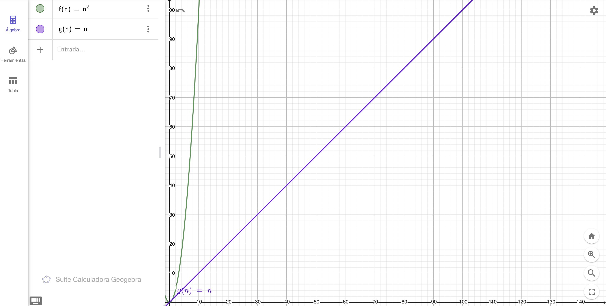

# Tabla de Contenidos
- [Introducción](#introducción)
- [Descripción del Problema](#descripción-del-problema)
- [Solución Fuerza Bruta](#solución-fuerza-bruta)
- [Solución Hash Map](#solución-hash-map)
- [Two Sum Ordenado](#two-sum-ordenado)
- [Conclusión](#conclusión)
- [Aprendizajes y Reflexiones](#aprendizajes-y-reflexiones)
- [Recursos](#recursos)

## Introducción
Uno de los problemas más comunes dentro de las entrevistas técnicas es el problema "Two Sum". El problema puede parecer fácil a simple vista, pero permite identificar al entrevistador, la capacidad del desarrollador para analizar la relación entre el uso de espacio y memoria. Además es fundamental entender este problema para resolver el problema "Three Sum". 

Comencemos!!

## Descripción del Problema

La descripción que encontramos en LeetCode es la siguiente:

> Dado un arreglo de enteros `nums` y un entero `target`, retornar los índices de los dos números cuya suma es igual al valor de `target`. Se asume que solo existe un solución por cada input y que no podemos utilizar el mismo elemento dos veces.

El problema viene con el siguiente ejemplo:

```
nums: [2, 7, 11, 15]
target: 9
res: [0, 1]
// Explicación: nums[0] + nums[1] = 2 + 7 === 9
```

## Solución Fuerza Bruta
La primera idea que se nos puede venir a la mente es iterar el arreglo utilizado dos loops anidados.

Tomamos un elemento del arreglo y verificamos si la suma de este valor con otro elemento del arreglo es igual a `target`. Si es el caso, retornamos los índices estos valores, caso contrario tomamos el siguiente número y así hasta el final. Si no encuentro un par de valores que cumplan con el requerimiento devuelvo un arreglo vacío.

La implementación sería la siguiente:

```javascript
const twoSum = (nums, target) => {
  for (let i=0; i < nums.length - 1; i ++) {
    for (let j= i + 1; j < nums.length; j++) {
      if (nums[i] + nums[j] === target) {
        return [i, j]
      }
    }
  }
  return [];
}

console.log(twoSum([2,7,11,15], 9)); // [0, 1]
console.log(twoSum([2,5,7,10,3], 10)); // [2, 4]
console.log(twoSum([2,5,7,10,3], 11)); // []
```

Una pequeña variación a este algoritmo parte del siguiente razonamiento:

Estamos buscando un valor `x` y un valor `y` para encontrar target. El for loop externo nos da el valor de x - (`nums[i]`), el valor de `target` ya lo tenemos. El único valor que nos falta es `y` - (`nums[j]`), que se encuentra en el for loop interno. El valor de `y` es igual a `target - x`. Utilizando esta fórmula podemos evitar realizar la suma cada vez que comparamos valores.

```javascript
const twoSum = (nums, target) => {
  for (let i = 0; i < nums.length - 1; i++) {
    const complement = target - nums[i]
    for (let j = i + 1; j < nums.length; j++) {
      if (nums[j] === complement) {
        return [i, j]
      }
    }
  }

  return []
}

console.log(twoSum([2,7,11,15], 9)); // [0, 1]
console.log(twoSum([2,5,7,10,3], 10)); // [2, 4]
console.log(twoSum([2,5,7,10,3], 11)); // []
```

Estos dos algoritmos planteados necesitan que por cada ítem, recorramos todo el arreglo, por lo que la complejidad de tiempo es $O(n^2)$ y la complejidad de espacio es $O(1)$.

Una complejidad cuadrática en un algoritmo no es recomendable, por lo que veamos si podemos hacerlo mejor.

## Solución Hash Map
La primera solución tiene una complejidad $O(n^2)$, la idea es tratar de buscar que la solución tenga un mejor complejidad, la que puede ser linear.

Si ponemos atención al problema, un dato es que existe una respuesta válida por cada entrada. Eso significa que para un valor `x` pude existir uno y solo un valor `y` tal que `x + y = target`. Con esto en mente, ¿será que podemos encontrar nuestros valores usando un solo loop?. 

Probemos lo siguiente, si tomamos el primer valor del arreglo `2` y calculamos su complemento este es igual a `9 - 2 = 7`. Entonces, si 7 existe en el arreglo, cómo en efecto lo está, solo necesitamos encontrarlo y este será el resultado. Generalizando, podemos guardar cada número y su índice en un `hash map` y si este es complemento de otro número, entonces es nuestra respuesta. 

La implementación sería la siguiente:

```javascript
const twoSum = (nums, target) => {
  const numsMap = nums.reduce((map, num, index) => {
    map[num] = index;
    return map;
  }, {});

  for (let i=0; i < nums.length; i++) {
    const complement = target - nums[i];
    if (complement in numsMap && i != numsMap[complement]) {
      return [i, numsMap[complement]];
    }
  }

  return [];
}

console.log(twoSum([2,7,11,15], 9)); // [0, 1]
console.log(twoSum([2,5,7,10,3], 10)); // [2, 4]
console.log(twoSum([2,5,7,10,3], 11)); // []
```

Si analizamos la complejidad de tiempo de este algoritmo podemos notar que tenemos dos loops no aninados, lo que me da $O(n) + O(n)$, que simplificando es igual a $O(n)$. Por otro lado, la complejidad de espacio es $O(n)$ dado que guardamos n número de elementos en el mapa.


Ahora, este algoritmo puede resultar redundante en algunos casos. Primero, tenemos dos loops, uno para generar el mapa y otro para encontrar los índices. Además volvemos a necesitar una condición para evitar que la suma se de entre el iguales elementos. Refactorizemos el código.


```javascript
const twoSum = (nums, target) => {
  const numsMap = {};

  for (let i=0; i < nums.length; i++) {
    complement = target - nums[i];
    
    if (complement in numsMap) {
      return [numsMap[complement], i];
    } else {
      numsMap[nums[i]] = i;
    }
  }

  return [];
}

console.log(twoSum([2,7,11,15], 9)); // [0, 1]
console.log(twoSum([2,5,7,10,3], 10)); // [2, 4]
console.log(twoSum([2,5,7,10,3], 11)); // []
```

En esta nueva versión solo utilizamos un loop. Este nos sirve para verificar si existe un valor complemento al índice que estamos evaluando y para guardar los valores con sus índices. Mucho más sencillo verdad.

La complejidad de tiempo y espacio se mantienen. Tiempo = $O(n)$ y Espacio = $O(n)$.

Esta solución es mucho mejor en comparación a la primera ya que tenemos un algoritmo de complejidad lineal. Sin embargo, en relación a espacio es peor, pasamos de un uso de espacio constante o un uso con crecimiento lineal.

Dependiendo del contexto, esta solución es la más optima dado que si bien sacrificamos espacio, nuestro algoritmo ahora es mucho más rápido.

## Two Sum Ordenado

Existe una variante a este problema que agrega los siguientes datos:

* El arreglo está ordenado
* La respuesta debe tener complejidad de espacio constante

Para enteneder la solución partamos del siguiente ejercicio mental:

Tenemos el arreglo = `[-4, -1, 1, 3, 5, 6, 8, 11]` y un valor target igual a `8`.

Que pasa si sumamos el valor del primer elemento con el del último: `-4 + 11 = 7`. Es valor que buscamos? No. Este valor es menor que el `target`.

Necesitamos que el valor de la suma crezca, para ello no utilezemos el menor valor del arreglo sino el segundo más pequeño, es decir `-1`. Entonces `-1+11 = 10`. Es el valor que buscamos? No. Pero el valor es mayor al que buscamos. 

Que hacemos? Necesitamos que el valor de la suma disminuya, para ello no utilizemos el valor más grande sino el segundo más grande, es decir `8`. Entonces `-1 + 8 = 7`. Es el valor que buscamos? No, es menor. Pero ya no estamos tan lejos.

Si seguimos usando esta lógica, moviendonos por la izquierda si el valor de la suma es menor al target o por la derecha si es mayor, nuestro algoritmo llegará a los valores de 3 y 5, que son el resultado.

Para que nos quede más claro, veamos la implementación.

```javascript
const twoSum = (nums, target) => {
  let leftIdx = 0;
  let rightIdx = nums.length - 1;

  while (leftIdx < rightIdx) {
    const sum = nums[leftIdx] + nums[rightIdx];

    if (sum === target) {
      return [leftIdx, rightIdx];
    } else if (sum > target) {
      rightIdx--;
    } else {
      leftIdx++;
    }
  }
  return [];
}

console.log(twoSum([-4, -1, 1, 3, 5, 6, 8, 11], 8)) // [3, 4] 
console.log(twoSum([2,7,11,15], 9)); // [0, 1]
console.log(twoSum([2,5,7,10,3], 10)); // [2, 4]
console.log(twoSum([2,5,7,10,3], 11)); // []
```
Al hacer el análisis de complejidad de tiempo vemos que este se mantiene cómo $O(n)$ pero la complejidad de espacio es $O(1)$ es decir constante.

## Conclusión
Para hacer este análisis me gustaría que comparar las 2 complejidades de tiempo. Para ello vamos a asumir que los arreglos están siempre ordenados. Veamos las siguientes gráficas de la complejidad de tiempo de los algoritmos.



Cómo se ve en la gráfica, los algoritmos que tienen una complejidad lineal son por mucho más eficientes que la solución por fuerza bruta, que tiene una complejidad cuadrática. 

Por otro lado si comparamos las dos soluciones lineales, podemos observar que aquella que utiliza dos punteros no requiere de espacio extra para dar respuesta al problema. Sin embargo, está limitada a esa condición. Por el contrario, la solución que usa el hash map funciona con cualquier arreglo sin importar el orden.

_¿Qué pasa si decidimos, primero ordernar el arreglo y luego aplicar la solución con dos puntureso?_

En primer lugar la complejidad de tiempo del algoritmo sería $O(nlogn)$, complejidad del algoritmo de búsqueda y mucho menos eficiente que la complejidad lineal. Por otro lado perdermos la referencia de los índices, por lo que nuestra respuesta no sería la correcta. Y si decidimos guardar los índices, estaríamos usando espacio, que es lo que buscamos evitar.


## Aprendizajes y Reflexiones
1. Siempre es bueno partir de la solución menos eficiente, esta práctica nos da luces acerca de que necesitamos optimizar en el código. En este caso fué la manera de construir los arreglos.
2. Niklaus Wirth comentó que `Algoritmos + Estructuras de Datos = Programas`. El saber combinar de manera correcta estos dos elementos va a ser que nuestro algoritmos sean mas eficientes. En este caso concreto, el utilizar un Hash Map hizo que nuestro algoritmo tuviera una complejidad lineal.
3. Siempre revisa o pregunta si tu arreglo está ordenado. Este dato puede hacer que construyas algoritmos mas rápidos.

## Recursos.
* https://leetcode.com/problems/two-sum/description/
* https://leetcode.com/problems/two-sum-ii-input-array-is-sorted/
