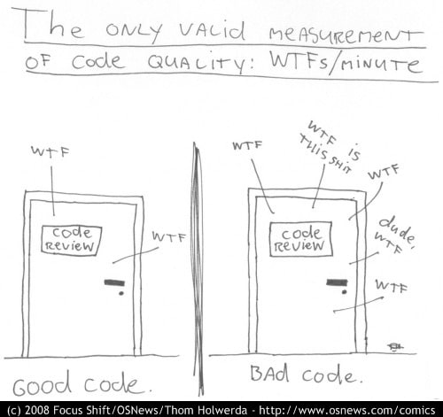

## Tabla de Contenidos
- [Introducción](#introducción)
- [Un poco de Tydings](#un-poco-de-tydings)
- [¿Quién es el principal cliente del código?](#qui%c3%a9n-es-el-principal-cliente-del-c%c3%b3digo)
- [Conclusión](#conclusión)
- [Recursos](#recursos)


## Introducción

El trabajo del desarrollador se ve muchas veces reducido a la construcción de nuevas funcionalidades o la solución de bugs. De hecho, esto se ve reflejado en la forma que estas tareas se encuentran estructuradas dentro de la planificación. Al final o se va a implementar algo o se va a arreglar algo.

Está simplificación tiende a que muchas veces nos enfoquemos solo en la resolución de problemas a través de un ordenador y nos olvidemos de las estructura de esas órdenes.

En ese contexto fue una grata sorpresa para mi encontrar el libro “Tidy First?” de Kent Beck, el cuál recomiendo 100%. En este se hace énfasis en una de las preguntas que cómo desarrollador nos hacemos todos los días ¿Debo arreglar este código de mie*** primero?.

## Un poco de Tydings
 


Una de las formas más fáciles que tuvo Robert C. Martín para definir que es un buen código fue en términos de cuantos dolores de cabeza y maldiciones produce el revisarlo. Si son muchos WTF definitivamente no es un buen código. Y es que ya lo diría Martin Fowler *“Cualquier tonto puede escribir código que una computadora pueda entender. Los buenos programadores escriben código que los humanos puedan entender”.*

El tema de “Clean Code” es muy amplio y existe basta literatura relacionada con el tema, pero Kent Beck se enfoca en su libro en un grupo de pequeñas acciones que pueden mejorar la legibilidad y la estructura del código a las que llama “Tydings”. Revisemos mejor con un ejemplo.

Digamos que estamos trabajando en una nueva funcionalidad y nos encontramos con la siguiente linea de código.

```tsx
const función = () => {
	/// .... código
	const result = (typeof input === 'string' ? input.trim() : (typeof input === 'number' ? (input > 0 ? 'positive' : 'negative') : 'invalid')) || 'default';
	/// ... más código
} 
```

Nuestra primera reacción es obviamente WTF? Es dificil de entender y tenemos poco tiempo para terminar la tarea, así que después de leerla un momento y consultar a otro compañero que hace esta línea, nos enteramos que es el resultado de una libreria para detectar el estatus de una cuenta. Este valor puede ser “positive”, “negative” o “invalid”, pero a veces suele devolver el resultado en números. Cuando el resultado sea “undefined” debemos devolver cómo “default”.

Lo se el código es un asco,  pero es la respuesta  de un tercero y no tenemos control ahí. Además no es parte de nuestra tarea principal arreglarlo y tenemos poco tiempo. ¿Qué podemos hacer? 

Lo mas rápido y uno de los “tidyings” que nos recomienda Kent Beck es dejar un comentario.

```tsx
const funciónFn = () => {
	/// .... código
	
	/*
	 ** Transformación de resultado de libreria para calcular estado de la ganancia de una cuenta en positivo y negativo.
	 ** El resultado puede ser devuelto cómo string, en números o "undefinded"
	 */
	const result = (typeof input === 'string' ? input.trim() : (typeof input === 'number' ? (input > 0 ? 'positive' : 'negative') : 'invalid')) || 'default';
	/// ... más código
} 
```

Ok, tal vez no solucione todos los problemas del mundo pero hemos evitado al menos un dolor de cabeza a la siguiente persona que se topen con esta línea de código, quizá a nosotros mismo. Lo interesante de aplicar “tydings” es que un siguiente desarrollador que se tope con esto puede hacer lo siguiente.

```tsx
const funciónFn = () => {
	/// .... código
	
	const accountStatus = transformAccountStatus(input);
	/// ... más código
}

/*
** Transformación de resultado de libreria para calcular estado de la ganancia de una cuenta en positivo y negativo.
** El resultado puede ser devuelto cómo string, en números o "undefinded"
*/
const transformAccountStatus = (noParsedAccountStatus: any)  => {
   return (
      typeof noParsedAccountStatus === 'string' 
        ? noParsedAccountStatus.trim() 
        : typeof noParsedAccountStatus === 'number' 
          ? noParsedAccountStatus > 0 ? 'positive' : 'negative'
          : 'invalid'
      ) || 'default';
}
```

La persona que ha hecho este cambio para mi ya es un héroe. La solución es perfecta, NO. Pero ha aplicado dos “tydings” que vuelven más claro el panorama. El primero extraer la función en un helper, lo que logra que la complejidad de esta línea sea encapsulada en una función y que tenga ya un significado cómo tal para la función padre. La segunda es aplicar simetrías, si bien seguimos teniendo todo en una sentencia, ahora se distribuyen en algunas líneas de código, lo que produce que podamos leerlo mejor.

Digamos que  unos días después alguien dice me parece que estamos haciendo muchas cosas en la misma linea de código: validamos tipos, hacemos transformaciones ademas de manejar diferentes tipos de inputs; entonces decide hacer lo siguiente.

```tsx
const funciónFn = () => {
	/// .... código
	const accountStatus = transformAccountStatus(input);
	/// ... más código
}

/*
** Transformación de resultado de libreria para calcular estado de la ganancia de una cuenta en positivo y negativo.
** El resultado puede ser devuelto cómo string, en números o "undefinded"
*/
const transformAccountStatus = (noParsedAccountStatus: any)  => {
	if (noParsedAccountStatus === undefined) return 'invalid';
	
	if (typeof noParsedAccountStatus === 'string') {
	  return noParsedAccountStatus.trim() || 'default';
	}
	
	if (typeof noParsedAccountStatus === 'number') {
		return noParsedAccountStatus > 0 ? 'positive' : 'negative';
	}
	
	return 'invalid'
}
```

Aquí el desarrollador decide aplicar otro “tyding”, aplicar “guardias”.  Eso significa primero validar que los elementos que entran a la función sean válidos antes de ejecutar la lógica de la función.

Después de realizar este primer arreglo se da cuenta de algunas cosas:

1. Undefined no es el único valor no definido que puede entrar a la función.
2. El valor ‘default’ solo aplica cuando el valor es un string.

Entonces procede a hacer un cambio más.

```tsx
const funciónFn = () => {
	/// .... código
	const accountStatus = transformAccountStatus(input);
	/// ... más código
}

/*
** Transformación de resultado de libreria para calcular estado de la ganancia de una cuenta en positivo y negativo.
** El resultado de la libreria puede ser cualquiere valor
*/
const transformAccountStatus = (noParsedAccountStatus: any)  => {
	if (!isNumber(noParsedAccountStatus) || !isString(noParsedAccountStatus))) {
		return 'invalid';
	}
	
	if (isString(noParsedAccountStatus)) {
	  return noParsedAccountStatus.trim() || 'default';
	} else {
		return noParsedAccountStatus > 0 ? 'positive' : 'negative';
	}
}

const isNumber = (input) => typeof input === 'number';
const isString = (input) => typeof input === 'string';
```

Genial, hemos encontrado a otro héroe. Este desarrollador primero se ha percatado que el comentario inicial estaba incorrecto, el resultado de la librería puede retornar más que números o strings. Hecho que no se había comentado al inicio, por ello corrige el comentario, aplica la creación de helpers y genera variables con mejor nombre y significado.

El código para mi está bien, sin embargo, podemos hacerle un pequeño “tyding” más. Sucede que alguien decide ir a ver la librería y ahora ellos han definido una interfaz para el string, garantizando que solo devuelva valores cómo “positive” o “negative”. Y esto le da la idea de que tal vez el default ya no sea necesario y que tal vez nuestra función necesite una interfaz. Manos a la obra.

```tsx

//main.ts
import { transformAccountStatus } from './account.ts'

const funciónFn = () => {
	/// .... código
	const accountStatus = transformAccountStatus(input);
	/// ... más código
}

// account.ts
import { isNumber, isString } from './utils.ts'

type AccountStatusType = 'positive' | 'negative' | 'invalid';

export const transformAccountStatus = (noParsedAccountStatus: any): AccountStatusType => {
	if (!isNumber(noParsedAccountStatus) || !isString(noParsedAccountStatus)) {
		return 'invalid';
	}
	return isString(noParsedAccountStatus)
		? noParsedAccountStatus
		: transformNumberAccountStatus(noParsedAccountStatus);
}

const transformNumberAccountStatus: 'positive' | 'negative' = 
	(input) => noParsedAccountStatus > 0 ? 'positive' : 'negative';

// utils.ts
const isNumber: boolean = (input) => typeof input === 'number';
const isString: boolean = (input) => typeof input === 'string';
```

Finalmente hemos decidido aplicar un poco de orden de cohesión. Las cosas que se relaciona van juntas y en su propio archivo. Además usando Typescript hemos definido una interfaz, lo que previene errores para futuro y obliga a que el resultado cumpla siempre con esos definición. Finalmente hemos eliminado el comentario, el código se explica ahora por si mismo.

Si volvemos a la sentencia inicial vemos que mantenemos una línea de código:

Antes:

```tsx
const funciónFn = () => {
	/// .... código
	const result = (typeof input === 'string' ? input.trim() : (typeof input === 'number' ? (input > 0 ? 'positive' : 'negative') : 'invalid')) || 'default';
	/// ... más código
} 
```

Ahora: 

```tsx
const funciónFn = () => {
	/// .... código
	const accountStatus = transformAccountStatus(input);
	/// ... más código
}

```

Pero el resultado es mucho mejor para el principal cliente del código. ¿Quién es este?

## ¿Quién es el principal cliente del código?

Quizá muchos de ustedes dirán después de la primera sección, porque tanto trabajo para una función que estaba bien y no hacía daño a nadie. Para ser muy sincero nunca he sido fan del “si funciona no lo toques”, esto es por que el principal cliente de nuestro código, no es el cliente, es otro programador. 

El usuario utiliza la funcionalidad y no le importa para nada como esta esté implementada, pero el que va a tener que revisar ese desarrollo, mantenerlo y mejorarlo es otro programador.

Es por ello que algunos “tydings” aplicados en la sección anterior, como otros señalados por Kent Beck en su libro permiten reducir el número de WTF que nuestro código produce si se aplican de manera adecuada. 

Expliquemos un poco mejor algunos de ellos

| **Tyding** | **Descripción** |
| --- | --- |
| Escribir comentarios | Explicación de lo que hace cierta sección de código o notas para comprender mejor la sentencia. |
| Eliminar comentarios redundantes | Identificar y remover comentarios que expresan exactamente una sección de código que se explica por si misma. |
| Extraer funciones utilitarias | Identificar secciones de código en una función o método que no está directamente relacionada a la función pero que sirve de soporte. |
| Guardias | Al inicio de una función o método hacer todas las validaciones sobre los parámetros. |
| Orden de cohesión y de lectura | Agrupar y ordenar el código que comparten una función en espacios comunes. |
| Normalizar simetrias | Usar patrones y formatos de código similares dentro de todo el proyecto. |
| Eliminar código muerto | Remover código que ya no se usa. |
| Variables y Constantes con significado | Promover que las variables y las constantes tengan un buen nombre |

Pequeños “tydings” cómo los mencionados en este momento quizá no son la panacea para todos los problemas que tiene nuestro proyecto pero nos permiten lo siguiente:

- Mejorar la legibilidad y el entendimiento del código.
- Analizar el uso de cierta sentencia o resultado pre existente en el código.
- Descubrir areas de mejora.

El software es un ente vivo que cambia constantemente, por lo que es altamente probable que el código que escribimos deba ser modificado o utilizado en otros contextos según lo requiera el proyecto. Es por ello que entre más fácil sea leerlo, más fácil será utilizarlo para resolver nuevos problemas.

> *El mayor costo del código es el costo de leerlo y entenderlo, no el de escribirlo* 
> 
> Kent Beck

## Conclusión

Quizá este blog deje muchas preguntas abiertas: ¿Cuándo debo aplicar estos “tidyings”? ¿Todas mis funciones deben ser así de detalladas? ¿Qué pasa cuando no tengo el tiempo para ordenar el código? ¿Y si en vez de ayudar termino dañando algo?

Estas preguntas son válidas y dan mucho sentido al por qué el libro se llama “Tyding First?” con un signo de interrogación. El autor nos explica en la segunda parte del libro el cuándo y cómo aplicar estos cambios, ideas que me gustaría abordar en un siguiente blog.

Por ahora, lo más importante que deseo que nos llevemos es que los “Tydings” son este conjunto de pequeñas acciones que nos permiten mejorar la calidad de nuestro código en función de la legibilidad y el entendimiento del mismo, para así evitarle en su medida dolores de cabeza a nuestros principales clientes, los otros desarrolladores.

## Recursos:

Tidy First, Kent Beck: https://learning.oreilly.com/library/view/tidy-first/9781098151232/ 

SE Radio 615: Kent Beck on “Tidy First”: https://open.spotify.com/episode/6XHBSDSSuH0xBDz1LeiAUE?si=44cab186651b486d
