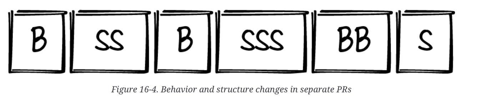

## Tabla de Contenidos
- [Introducción](#introducción)
- [El verdadero valor y costo del software](#el-verdadero-valor-y-costo-del-software)
- [Estructura vs Comportamiento](#estructura-vs-comportamiento)
- [¿Cuándo? y ¿Dónde?](#cu%c3%a1ndo-y-d%c3%b3nde)
- [Conclusión](#conclusión)
- [Recursos](#recursos)


## Introducción

En el post anterior [(link si no lo has revisado)](https://blog.jeankaobando.com/blog/2024/from-functional-to-readable/) discutimos el uso de "Tidyings", pequeñas acciones que mantienen una estructura limpia y, sobre todo, comprensible de nuestro código. Sin embargo, quedó pendiente abordar cuándo y dónde aplicar estos cambios. Si bien el cliente principal de nuestro código es otro programador, el cliente final sigue siendo el usuario, a quien no le importa si nos demoramos tres semanas arreglando nuestro código; lo que quiere es ver que la aplicación funcione y que se desarrollen nuevas funcionalidades.

Por ello, en esta ocasión vamos a entender cómo aplicar "Tidyings" y reforzar su importancia. Pero primero, profundicemos en el valor y el costo del software.

## El verdadero valor y costo del software

Imaginemos que vamos a un restaurante especializado en pizza artesanal. Hemos estado allí tres veces y el sabor es excelente, especialmente la pizza de la casa. Esta vez, decidimos llevar a nuestra cita para impresionarla, y nuestras expectativas son altas.

Por otro lado, el restaurante, con solo tres meses de operación, enfrenta dificultades. No han logrado medir su éxito y su cocina es demasiado pequeña para satisfacer la demanda diaria. Además, solo tienen ingredientes para sus tres tipos de pizzas más populares. La organización del espacio de trabajo es caótica; al principio, con solo dos cocineros, era fácil encontrar las cosas, pero ahora, para los dos nuevos ayudantes, es una verdadera pesadilla. En ese ambiente, todos corren y el descontento es evidente.

Al llegar al restaurante y preguntar por nuestra reservación, nos sorprenden diciendo que el lugar está lleno y que han dado nuestra mesa a otra pareja, pidiéndonos esperar 15 minutos. Molestos, reclamamos y nos asignan un lugar incómodo cerca de la cocina, pero nos decimos: "Tranquilo, la comida es buena, saldremos de esta". Llamamos al mesero para ordenar lo de siempre, pero a nuestra acompañante le llama la atención una pizza de frutas y la pide. Intuimos que algo va mal porque el mesero toma la orden con preocupación.

Finalmente, nuestra orden llega en 5 minutos, pero la de nuestra cita tarda una hora; cada vez que preguntamos, nos aseguran que ya va a salir. Durante ese tiempo, escuchamos platos quebrándose en la cocina y discusiones generalizadas. El servicio fue pésimo y ni siquiera la pizza de la casa estuvo buena.

Al salir, decidimos reclamar; quedamos mal con nuestra cita y el restaurante arruinó la noche. Nos explican que han tenido problemas para crecer, que la pizza de frutas no es muy solicitada y tuvieron que buscar los ingredientes. Además, su sistema de reservas se había caído una hora antes. Deciden no cobrarnos, pero eso no cambia el hecho de que no volveremos.

Analizando esta historia, podemos destacar dos puntos clave:

1. El restaurante comenzó bien, con recetas exitosas. Sin embargo, no se enfocaron en un crecimiento ordenado. Aumentaron las ventas, pero su sistema ya no podía soportarlo.
2. Aunque entendimos sus problemas y sentimos empatía, eso no era nuestra preocupación; queríamos disfrutar de una noche agradable y la arruinaron. Como resultado, perdieron no solo el ingreso de ese día, sino también un cliente.

Esto es precisamente lo que ocurre al crear software. Las empresas y sus desarrolladores se concentran tanto en lanzar funcionalidades rápidamente que descuidan la deuda técnica y las áreas de mejora. El proyecto funciona bien cuando es pequeño, pero cuando crece el código se vuelve un caos, lo que dificulta y hace riesgosa la implementación de cambios. El ambiente se vuelve hostil: el desarrollador está estresado porque teme dañar algo al hacer cambios, los dueños se frustran porque las tareas que antes eran rápidas ahora toman más tiempo, y los usuarios abandonan la aplicación, no sin antes quejarse de que las primeras versiones eran buenas pero ahora nada funciona.

> El software crea valor de dos formas:
> 1. Haciendo cosas hoy
> 2. En la posibilidad de hacer nuevas cosas mañana.
> 
> Kent Beck


Kent Beck enfatiza precisamente esto: el valor del software no radica simplemente en su capacidad actual, sino en su flexibilidad para adaptarse y enfrentar cambios futuros.

Por eso, la legibilidad y mantenibilidad de nuestro código son fundamentales para el crecimiento exitoso de nuestro sistema. Como mencionamos antes: el verdadero costo del software no está en escribirlo, sino en leerlo y entenderlo.

El libro propone la siguiente relación:

$$
cost(software) \cong cost(cambio)
$$

Sin embargo, los cambios más costosos son aquellos que requieren más tiempo de implementación. Por lo tanto, la relación más precisa es:

$$
cost(software) \cong cost(grandes cambios)
$$

Los grandes cambios están estrechamente relacionados con el nivel de acoplamiento del código. Cuantos más elementos se interrelacionen entre sí, más complejo será realizar cambios sin afectar otras partes. Esto lleva a la siguiente relación:

$$
cost(grandes cambios) \cong cost(coupling)
$$

Si el costo del software es aproximadamente igual al costo de hacer grandes cambios, y este a su vez es aproximadamente igual al nivel de acoplamiento de nuestra aplicación, entonces podemos concluir que el costo del software es aproximadamente igual al nivel de acoplamiento del sistema.

$$
cost(software) \cong cost(coupling)
$$

Esta relación se conoce en el libro como la **Equivalencia de Constantine**.

El tema del acoplamiento es extenso y merecería otro post, pero por ahora es crucial entender que nuestro enfoque no debe limitarse a desarrollar funcionalidades, sino también a mantener nuestro espacio de trabajo preparado para los cambios. Veamos cómo hacerlo a continuación.

## Estructura vs Comportamiento

Como hemos mencionado, el valor del software se define por su capacidad de hacer cosas hoy y estar listo para hacer cosas mañana. En otras palabras, el tipo de código que escribimos afectará cómo funciona o cómo se ve. Por eso, es común ver pull requests con un historial de commits como este:

```yaml
a1b2c3d refactor: isolate wishlist query function
i7j8k9l feat: add API routes for wishlist management
e4f5g6h refactor: create helper function to parse wishlist user's names
m0n1o2p feat: add initial wishlist backend structure
```

En este ejemplo, observamos dos tipos de cambios: de comportamiento y de estructura. Veamos sus definiciones:

- Los cambios de comportamiento son aquellos que añaden, modifican o eliminan funcionalidad en nuestro código. Afectan cómo el usuario final interactúa con la aplicación y, por ende, son difíciles de revertir. Por ejemplo, si has dado a un usuario la opción de buscar por tipos, no querrás quitársela solo porque descubriste un error.
- Los cambios de estructura buscan mejorar la legibilidad o mantenibilidad del código. Estos cambios deben garantizar que el sistema funcione igual que antes y que sean fácilmente reversibles en caso de error. Por ejemplo, si se extrae una sección de una función como función auxiliar, no debería ser complicado volver a integrar ese código en su lugar original si fuera necesario.

Esta distinción nos muestra que cada tipo de cambio requiere su propio enfoque. En los cambios de comportamiento, nos centramos principalmente en implementar lógica de negocio que debe probarse en diversos escenarios. En los cambios de estructura, el objetivo es mejorar la organización del código, ya sea aplicando "Tidyings" o realizando refactorizaciones más amplias.

Por eso, el libro recomienda abordar estos dos tipos de cambios por separado, siempre que sea posible.




## ¿Cuándo? y ¿Dónde?

Una vez que entendemos que es preferible manejar los cambios de estructura de manera independiente, surge la pregunta de cuándo y dónde aplicarlos.

El libro "Tidy First?" propone cuatro momentos: Nunca, en otro momento, después de, y antes de.

- **Nunca:** Es probable que en nuestros proyectos existan secciones que varían poco con el tiempo, como configuraciones, conexiones a bases de datos o implementaciones de reglas de negocio fijas. En estos casos, refactorizar no genera valor futuro y ese tiempo puede invertirse en áreas más críticas.
- **En otro momento:** Si al realizar un cambio identificas que mejorar cierta sección no aporta un beneficio inmediato, siendo más un "sería bueno tenerlo", entonces incluye ese arreglo en tu lista de tareas pendientes. Si eres líder técnico, busca siempre espacios en el sprint para ir saldando esa deuda técnica.
- **Después de:** Si durante una tarea o implementación de funcionalidad identificas una función que "debe" ser mejorada, pero no es el momento adecuado porque podría retrasar el desarrollo, anota esa tarea y comprométete a abordarla inmediatamente después de terminar la tarea actual.
- **Antes de:** Si aplicar un "Tidying" facilitará la implementación de una tarea y garantizará una entrega más robusta o por otro lado no nos quita mucho tiempo a nuestra tarea principal, adelante, no lo pospongas.

Identificar el momento adecuado requiere experiencia, pero la idea es siempre tener presente que debemos "mantener nuestra cocina limpia". Ya sea que apliques los cambios en grupo, después de una tarea o antes de ella, recuerda su importancia y no relegues estos cambios al final del backlog.

Otra pista útil al tomar decisiones es considerar que al código también se le aplica la "Ley de Pareto": el 80% de los cambios se concentra en el 20% del código. Es crucial identificar en nuestros proyectos cuáles son los archivos y funciones más frecuentemente modificados, para mantenerlos organizados y preparados para futuros cambios.

## Conclusión

El valor del software y de nuestros sistemas no reside solo en las características que ofrecemos a nuestros clientes, sino en su capacidad para incorporar nuevas funcionalidades en el futuro. Esta capacidad de preparación para el futuro depende de la facilidad con que podamos buscar, modificar o añadir código en nuestros proyectos.

Para lograrlo, es fundamental diferenciar entre los cambios de comportamiento y los cambios estructurales, e identificar el momento oportuno para aplicar cada tipo de cambio.

Finalmente, es crucial mantener siempre presente la pregunta: "¿Cómo puedo mejorar mi código?" y no permitir que la deuda técnica se acumule en nuestro backlog.

Un tema que nos ha quedado pendiente discutir es “coupling”, déjame saber si te gustaría tener un post dedicado solo a este tema.

## Recursos:

Tidy First, Kent Beck: https://learning.oreilly.com/library/view/tidy-first/9781098151232/ 

SE Radio 615: Kent Beck on “Tidy First”: https://open.spotify.com/episode/6XHBSDSSuH0xBDz1LeiAUE?si=44cab186651b486d
