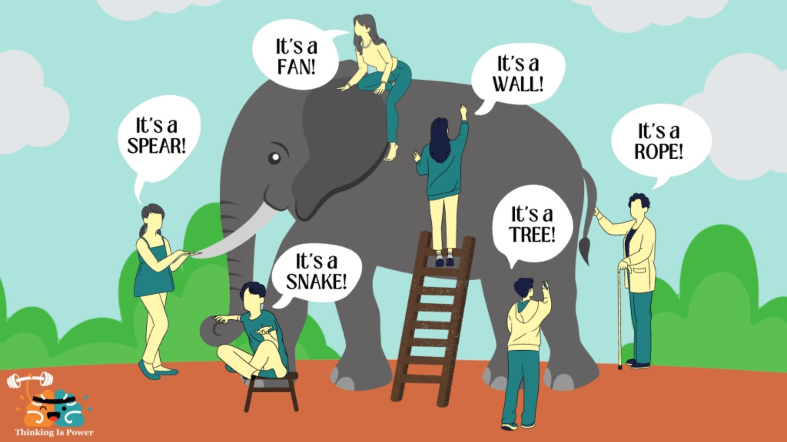

## Tabla de Contenidos

- [Introducción](#introducción)
- [Reconocer nuestro subdominio](#reconocer-nuestro-subdominio)
- [Bounded Context: delimitando el terreno](#bounded-context-delimitando-el-terreno)
- [Mismos nombres, diferentes significados](#mismos-nombres-diferentes-significados)
- [Conclusión](#conclusión)
- [Recursos](#recursos)

## Introducción

En el día a día, los sistemas son complejos. Es muy difícil, por no decir imposible, que una persona o grupo de personas pueda conocer todos los detalles de cómo funciona el software de una empresa. La pregunta es: ¿eso importa?

Comenzamos esta serie haciendo énfasis en el lenguaje. Recalcamos que para construir soluciones centradas en el negocio y no en la tecnología era importante entender la razón de ser de nuestros sistemas. Pero me gustaría hacer un matiz: no es necesario que conozcamos el panorama completo a profundidad. Lo importante es identificar la parte del negocio en la que trabajamos, sus objetivos, términos, reglas y cómo se relaciona con otras partes del sistema.

Es por esa razón que terminamos el capítulo anterior hablando acerca de delimitar el lenguaje. 

En esta ocasión vamos a centrarnos en eso. En identificar en qué parte del sistema estamos y cómo construir soluciones que funcionen en ese contexto.

Comencemos.

## Reconocer nuestro subdominio

Pongamos atención a la siguiente imagen:

Vamos a imaginarnos que trabajamos en una empresa donde uno de sus anuncios es similar al de la imagen anterior. ¿Qué servicios estamos ofertando?

- Compra por catálogo
- Pagos con tarjeta de crédito y PayPal
- Promociones y Descuentos
- Entrega a domicilio
- Seguimiento de envíos

En este ejemplo es muy fácil identificar el **dominio** de nuestro sistema, **E-commerce**. Pero si lo analizamos a detalle, estos servicios abarcan áreas diferentes de la empresa y cada uno de ellos maneja un lenguaje diferente. Por ejemplo, en “Catálogos” pueden hablar de búsquedas, filtros, productos destacados; en “Entregas” necesitan hablar de direcciones, puntos de entrega, estados del envío; mientras que “Pagos” define términos como transferencias, moneda, impuestos, método de pago. Cada uno de ellos corresponde a un subdominio dentro del dominio de E-commerce.

> *📖 Un subdominio es un área específica del dominio*
> 

Un subdominio se identifica por las conversaciones que existen alrededor de él y las expectativas que tiene la empresa sobre el grupo que trabaja en esta área. Por lo general, en esas conversaciones se definen acciones, reglas y términos que describen los problemas del día a día. Y es precisamente cuando agrupamos este conjunto de elementos del negocio que tenemos las herramientas para establecer esos límites en nuestros sistemas. Esto permite que nuestras soluciones estén enmarcadas dentro de contextos delimitados o Bounded Contexts.

## Bounded Context: delimitando el terreno

Tomemos del ejemplo anterior los servicios seguimiento de envíos y entrega a domicilio, los vamos a encapsular dentro del subdominio **“Envíos”.**

Si nos centramos solo en este subdominio podemos identificar, de las conversaciones con los expertos del dominio (Product Owners, Gerentes, Consultores), ciertas acciones que se realizan en esta área:

- Generar órdenes de envío
- Asignar transportista
- Despachar envío
- Confirmar entrega
- Reprogramar entrega

Además, si te fijas con atención también percibes que se definen algunas reglas sobre estas acciones, por ejemplo:

- Un transportista no puede tener más de 10 órdenes de envío al día
- Se requiere la firma del ordenante para confirmar la entrega
- Solo se puede reprogramar una entrega 3 días antes de la fecha de entrega

Con estos elementos tú puedes comenzar a definir un conjunto de términos comunes que pueden alinear la comunicación y la aplicación de estas acciones con sus reglas en el sistema, por ejemplo:

- **Orden de envío:** Instrucción formal para trasladar un pedido desde el almacén hasta la dirección del cliente.
- **Transportista:** Persona o empresa responsable de trasladar el paquete (puede ser interno o un proveedor externo).
- **Guía / Tracking:** Código único que identifica y permite rastrear un envío en todo su recorrido.

Estos elementos de negocio, que definen un área específica, son lo que en DDD se conocen como “Bounded Contexts”. Eric Evans lo define así:

> *📖 Un Bounded Context es una parte definida del software donde ciertos términos, definiciones y reglas se aplican de manera consistente*
> 

Sin embargo, es posible que los mismos términos se utilicen en diferentes Bounded Contexts con significados diferentes. Este es precisamente el desafío que Evans ilustra con la famosa parábola del elefante y los hombres ciegos, que veremos a continuación.

## Mismos nombres, diferentes significados

En su libro **Domain-Driven Design: Tackling Complexity in the Heart of Software**, Eric Evans se apoya en la parábola del “Elefante y los hombres ciegos” para explicar que el dominio puede representar diferentes cosas dependiendo del subdominio en que el equipo esté interactuando.

Así como para el hombre que toca el colmillo el elefante es como una lanza, para quien está en las piernas es como un árbol; en nuestros sistemas también el entendimiento del negocio de quien trabaja en pagos va a ser completamente diferente a quien trabaja envíos.

En este proceso, es muy común, que se utilicen los mismos nombres para definir conceptos totalmente diferentes. Por ejemplo un “artículo” para Pagos tiene las propiedades de precio, marca, aplica descuento, pero para Envíos tiene las propiedades de peso, dimensiones, condición de embalaje.

Esto no es un problema como tal, de hecho es lo recomendable según Eric Evans, que cada término describa específicamente el problema que está resolviendo en su contexto.

Sin embargo, es importante tener clara esta situación. Especialmente, cuando tenemos que definir relaciones entre diferentes Bounded Contexts, para así evitar que la integridad de nuestro contexto se comprometa. Esto será tema de un próximo capítulo, pero por ahora es importante reconocer que van a existir este tipo de situaciones.

## Conclusión

Toda solución de software se construye dentro de un contexto, definido por los elementos del negocio propios del subdominio en el que trabajamos.

Los Bounded Contexts nos permiten que ese conjunto de términos, reglas y acciones del negocio se encuentren bien definidas y sirvan como guía para el desarrollo de nuestras soluciones; permitiendo que los equipos se centren en resolver problemas que agregan valor a la empresa en lugar de distraerse con detalles tecnológicos secundarios.

En el siguiente capítulo veremos cómo se definen estos elementos de negocio en un Bounded Context y cómo esto se traduce a software. Nos vemos.

## Recursos

* Evans, E. (2004). Domain-driven design: Tackling complexity in the heart of software. Addison-Wesley Professional.
https://learning.oreilly.com/library/view/domain-driven-design-tackling/0321125215/
* Lerman, J., & Smith, S. (2014). Fundamentals of Domain-Driven Design. Pluralsight.
https://app.pluralsight.com/library/courses/fundamentals-domain-driven-design/table-of-contents
