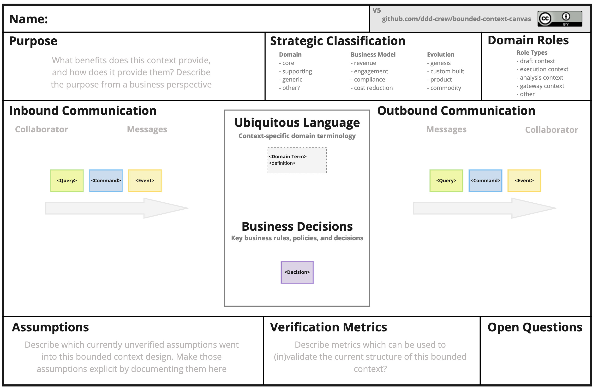

## Tabla de Contenidos

- [Introducción](#introducción)
- [Guíate en las acciones](#gu%c3%adate-en-las-acciones)
- [Entidades, Value Objects e Invariants](#entidades-value-objects-e-invariants)
- [Modelando nuestro Bounded Context](#modelando-nuestro-bounded-context)
- [Conclusiones](#conclusiones)
- [Recursos](#recursos)


## Introducción

El software se construye alrededor de un conjunto de términos, acciones y reglas definidos por el subdominio del negocio sobre el que opera. Es la correcta implementación de estos elementos los que da su valor. Sin embargo, muchas veces estos detalles se pierden en nuestra arquitectura debido a que se organizan con base a los elementos técnicos o simplemente no se organiza.

Este es el principal objetivo de Domain-Driven Design, que el modelo de nuestro sistema y su implementación esté guiada siempre por el negocio. De esta manera podemos poner nuestro esfuerzo y enfoque en los elementos que dan valor.

En los capítulos anteriores de esta serie comentamos acerca de la importancia del lenguaje y cómo es este el que nos permite poner límites claros a nuestros sistemas. Estos límites Eric Evans los define como Bounded Contexts.

Las preguntas que me hago para este capítulo son: ¿Cómo se modelan estos elementos del negocio en un Bounded Context? ¿Cómo guían la implementación de nuestros sistemas?

## Guíate en las acciones

Retomemos el ejemplo visto en el capítulo anterior [(link aquí)](https://blog.jeankaobando.com/blog/2025/ddd-serie-part-2-bounded-context/) y trabajemos con el Bounded Context “Envíos” donde se definieron ciertas acciones:

- Generar órdenes de envío
- Asignar transportista
- Despachar envío
- Reprogramar entrega

Ahora nuestro trabajo es implementar una de estas acciones y en ese proceso conocer más acerca de nuestro subdominio.

Vamos a tomar “Generar órdenes de envío” como la primera acción de negocio a implementar. Simulemos una conversación con un PM con la ayuda de ChatGPT

```yaml
## Ejemplo: Conversación con un PM para entender el proceso de "Generar una Orden de Envío"

**Dev:** ¿Qué significa exactamente “generar una orden de envío”?  
**PM:** Es crear la **instrucción formal** de que un pedido debe moverse del almacén al cliente.  
En nuestro lenguaje de negocio lo llamamos **Orden de envío**. Es el registro oficial que inicia el proceso logístico.

---

**Dev:** ¿La instrucción formal es lo mismo que una orden de envío?  
**PM:** Sí. “Instrucción formal” lo dije como explicación, pero el término correcto en nuestro *Lenguaje Ubicuo* es **Orden de envío**.

---

**Dev:** ¿Qué elementos tiene una Orden de envío?  
**PM:**  
- Tracking ID (identificador único)  
- Pedido asociado  
- Dirección de destino  
- Estado actual  
- Fecha de creación  
- (Opcional más adelante: transportista, condiciones especiales)

---

**Dev:** ¿Cuál sería la versión mínima para un MVP?  
**PM:**  
- Tracking ID único  
- Pedido asociado confirmado/pagado  
- Dirección de destino válida  
- Estado inicial = “Creada”  
- Fecha de creación

---

**Dev:** ¿Qué reglas se aplican al crear una Orden de envío?  
**PM:**  
1. El pedido debe estar confirmado/pagado.  
2. La dirección debe ser válida.  
3. El Tracking ID debe ser único.  
4. El estado inicial siempre es “Creada”.  
5. Se debe registrar la fecha de creación.

---

**Dev:** Entonces, para generar un envío necesito:  
- Confirmación de pago  
- Generar un ID único  
- Añadir dirección válida  
- Estado inicial “Creada”  
- Fecha de creación  

¿Me falta algo más?  

**PM:** Está perfecto. Lo único adicional que podrías incluir (si el negocio lo requiere) son **los datos de origen** del envío, pero con lo que tienes ya puedes empezar el proceso.

---
```

> 👀 **TIP:** Este tipo de conversaciones deben ser el día a día de nuestro trabajo, especialmente si somos líderes técnicos o arquitectos. Si no las tenemos es muy probable que construyamos software a ciegas.
> 

La conversación con el PM nos da luces sobre cómo debemos implementar la acción “Generar orden de envío”. De ella podemos obtener la siguiente información:

- El concepto sobre el cual gira la conversación parece ser la “Orden de Envío”
- Una orden de envío maneja un proceso, por ello tiene estados
- La dirección es otro elemento importante para generar órdenes de envío.
- Estas acciones parecen ser desencadenadas por otro Bounded Context, dado que hay un elemento no ligado directamente a “Envíos” llamado “Pedido” y su valor influye en sí se ejecuta o no nuestra acción.

Estos hallazgos son la materia prima del modelo que construiremos. 

Con estos elementos definidos es momento que el software comience a ser protagonista y ubiquemos estos elementos en un modelo que guíe la construcción de nuestro sistema. 

## Entidades, Value Objects e Invariants

Hasta este momento he hecho mucho énfasis acerca de entender los conceptos, definiciones y reglas que están alrededor de nuestro subdominio. En este momento vamos a entender el motivo.

Partiendo de nuestro ejemplo, “Envío” es uno de los elementos centrales del BC. Este elemento tiene algunas características:

- Es un elemento identificable (tiene un ID)
- Tiene un conjunto de propiedades que lo definen: estado del envío, dirección, fecha de creación.
- Sobre este elemento se ejecutan acciones de negocio:
    - Crear orden de envío
    - Actualizar estado

Cuando un objeto tiene este conjunto de características DDD lo define como una **Entidad.**

> 💡 **Entidad:** Es un objeto que está definido principalmente por su identificador
> 

Pero en nuestra conversación también salieron otros elementos como Dirección que presenta las siguientes características:

- No tiene un identificador
- Es inmutable (*“Ejemplo: una Dirección siempre describe la misma calle y número aunque la consultemos varias veces”*).
- Describe “algo” dentro del sistema

Para DDD, cuando un elemento reúne este conjunto de cualidades lo denomina **Value Object.**

> 💡 **Value Object:** Describe las características de un objeto pero no posee un identificador.
> 

Finalmente, en el proceso para crear una orden de envío se definen algunas reglas que se deben cumplir para ejecutar la acción, por ejemplo *“el pedido debe estar confirmado o pagado para crear la orden”.* 

Cuando nos encontramos con condiciones y reglas cuya evaluación siempre debe ser verdadera DDD las denomina **Invariants**

> 💡 **Invariant:** Reglas que siempre deben ser verdaderas para que el sistema mantenga un estado consistente.
> 

Eric Evans propone más elementos que iremos explorando con el tiempo, pero con estos tres ya tenemos suficiente para empezar.

Con todos estos conceptos claros ¿qué tal si modelamos nuestro BC Envíos?

## Modelando nuestro Bounded Context

La comunidad de DDD es muy activa y existe en especial una, como el [DDD-Crew](https://ddd-crew.github.io/), que provee un conjunto de recursos que nos ayudan a aterrizar estos conceptos en modelos gráficos. Te comparto el link para que los puedas explorar: https://github.com/ddd-crew/ddd-starter-modelling-process.

De este conjunto de elementos, en esta ocasión vamos a utilizar el relacionado con Bounded Context. DDD-Crew nos provee de una plantilla en donde podemos ubicar cada una de las ideas que discutimos en la sección anterior. La plantilla es la siguiente:



Como pueden ver en la imagen, en esta plantilla podemos formalizar el nombre de nuestro BC y su propósito. Categorizarlo como parte de un subdominio central, de soporte o genérico (ya veremos estas categorías a profundidad en un futuro post). Describir explícitamente las acciones de nuestro sistema, sus entidades y reglas. Finalmente, contamos con una sección para describir algún supuesto, métricas de cómo evaluar las acciones del BC y preguntas.

Para nuestro ejemplo el resultado sería el siguiente:

")

> 🗒️ ***Nota:** Algunos términos se encuentran en inglés en el modelo debido a que estos se transformaran en el nombre de las clases, funciones y eventos que se implementarán en el código, que por estándar se escribe en este idioma.*
> 

Cómo podemos ver, con este modelo tenemos una guía clara de qué hace nuestro BC Shipments por ahora, por ejemplo:

- Su propósito es la administración del envío de artículos, entonces es evidente para nosotros que cualquier acción o concepto que no encaje en ese propósito debe ubicarse en otro lado (Ejemplo: el pago de las órdenes)
- Se enfatiza en que “Envíos” es un subdominio de soporte para el dominio de E-commerce. Es decir, no es un factor diferenciador para nuestro negocio pero es necesario para que este opere.
- Está explícita la relación con el Bounded Context “Orders” y que el desencadenante para iniciar nuestra acción será el evento “OrderPaid”.
- Se definen las métricas de negocio sobre las cuales se van a evaluar las acciones ejecutadas en este sistema.

Un Bounded Context puede ser modelado de diferentes formas, pero esta herramienta de DDD-Crew en mi opinión permite servir como puente entre el negocio y desarrolladores dado que plantea un lenguaje común sobre el cual se van a dar las conversaciones sobre este subdominio. 

## Conclusiones

DDD nos invita a centrar nuestros esfuerzos en construir software guiado por el dominio. En un Bounded Context nosotros podemos describir formalmente ese conjunto de términos, reglas y acciones que guían al negocio en un modelo, convirtiéndose en una herramienta poderosa en pro de la construcción de soluciones que den valor a nuestra organización. 

En el siguiente capítulo, el final de nuestra serie, vamos a implementar este BC en código y comprender cómo este proceso nos ha permitido que el negocio hable y que el código escuche.

## Recursos

Evans, E. (2003). *Domain-driven design: Tackling complexity in the heart of software*. Addison-Wesley Professional. [https://learning.oreilly.com/library/view/domain-driven-design-tackling/0321125215/](https://learning.oreilly.com/library/view/domain-driven-design-tackling/0321125215/?utm_source=chatgpt.com)

Pluralsight. (s. f.). Fundamentals of Domain-Driven Design. Pluralsight. https://app.pluralsight.com/library/courses/fundamentals-domain-driven-design/table-of-contents

DDD-Crew. (s. f.). *Bounded context canvas*. GitHub. [https://github.com/ddd-crew/bounded-context-canvas](https://github.com/ddd-crew/bounded-context-canvas?utm_source=chatgpt.com)
