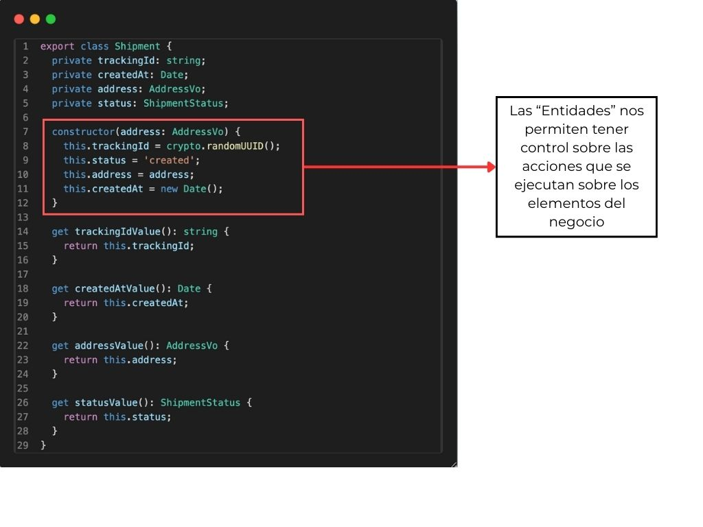

## Tabla de Contenidos

- [Introducción](#introducción)
- [¿Qué tenemos que implementar?](#qu%c3%a9-tenemos-que-implementar)
- [DDD en acción](#ddd-en-acci%c3%b3n)
- [Screaming Architecture](#screaming-architecture)
- [Conclusiones](#conclusiones)
- [Recursos](#recursos)

## Introducción

A lo largo de esta serie hemos comentado la importancia de construir software con el negocio en el centro. Para ello, nos hemos apoyado del acercamiento propuesto por Eric Evans en el 2003, Domain-Driven Design.

Hemos hecho énfasis en la importancia del lenguaje y cómo delimitarlo dentro de un contexto es muy útil al momento de construir software. Por lo general, una organización (dominio) divide sus problemas en partes (subdominios) sobre los cuales se establecen un conjunto de términos, acciones y reglas que solo tienen sentido (y es bueno que así sea) en ese contexto. Finalmente, comentamos que estos elementos se delimitan según DDD en “Bounded Contexts”.

En este blog, el último de esta serie, es momento de que el software escuche. Es por ello que nos vamos a adentrar en la implementación de la acción de negocio “Generar órdenes de envío”.

Comencemos.

## ¿Qué tenemos que implementar?

A partir del Bounded Context descrito en el [capítulo anterior](http://localhost:1313/blog/2025/ddd-serie-part-3-modeling-bc/) (imagen 1), tenemos la siguiente información sobre la acción ‘Generar órdenes de envío’.

")

- Intervienen dos Bounded Context en la acción, Shipments (para envíos) y Orders (órdenes de pago). Este último desencadena el proceso.
- Tenemos a la mano una regla de negocio clara: *“una orden debe estar confirmada o pagada para poder generar una orden de envío”*
- Nuestra Entidad “Shipment” (Envío) debe tener un trackingID, una dirección válida, el estado inicial debe ser “creado” y se debe registrar la fecha de creación.
- La dirección es un Value Object porque no tiene un ID, pero sí reglas claras, como que solo se permiten envíos a Quito y Guayaquil en Ecuador.
- Finalmente, el resultado de la generación debe ser emitir un evento que será receptado por el mismo Bounded Context.

Con estos elementos ya tenemos todo lo necesario para empezar a programar.

## DDD en acción

Para el propósito de este blog no nos vamos a detener en la configuración del proyecto. Ustedes pueden descargarlo en el siguiente [repositorio de Github](https://github.com/boceto1/compra-ya-demo-ddd) (no olvides dejar una estrella) e instalarlo siguiendo la descripción del README.

Comencemos con la estructura, como se observa en la imagen 2, a nivel del repositorio se deja claro que por ahora vamos a trabajar con dos Bounded Context: Orders y Shipments. Siendo estos los únicos módulos que está importando el proyecto central.

Ahora centrémonos en la estructura de Shipping. Para ello hemos decidido organizar el código aplicando “Clean Architecture” que es una metodología propuesta por Robert C. Martin y que aplica perfecto para DDD.

Como se ve en la imagen 3, siguiendo esta metodología hemos dividido nuestra implementación de Shippings en 3 partes:

- **Application**: dónde van a vivir todas las acciones de negocio definidas
- **Domain**: dónde se definen las entidades y value objects.
- **Presentation**: dónde se implementan los mecanismos para que el exterior pueda interactuar con estas acciones de negocio. Estas pueden ser interfaces, controladores o eventos.

Clean Architecture plantea una capa más que es **Infrastructure** dónde están todos los elementos externos cómo apis, bases de datos, cache; sin embargo al no utilizarlos todavía no los hemos definido.

Veamos cómo definimos nuestra acción “generar órdenes de envío” en nuestro caso de uso. Cómo se ve en la imagen 4, el caso de uso debe describir la acción tal cual la planteo el negocio. En nuestro caso evaluamos la regla sobre el estado de la orden asociada, validamos que la dirección sea válida, generamos la orden y notificamos. Si nos fijamos bien, aquí no debe haber referencias a frameworks o bases de datos, estamos ejecutando la lógica de negocio.

Ahora bien, por que tenemos que crear una dirección y no simplemente pasamos los valores recibidos al constructor de la orden. La respuesta es que la dirección es un elemento que puede tener sus propias reglas. Ejemplo: las ciudades de envío solo pueden ser Quito o Guayaquil. Al encapsular esto en el Value Object como se ve en la imagen 5 no solamente agrupamos estas reglas en dirección, sino que si tenemos que implementar otra acción como por ejemplo “reubicar orden” no necesitamos volver a poner las reglas, estás viven en el value object. Ahí el valor.

Nuestras entidades son el corazón de nuestro Bounded Context, dado que sobre ellas ejecutamos acciones de negocio. En la imagen 6 vemos como la Entidad garantiza que la creación correcta del objeto cumpla lo especificado por el negocio. Un detalle importante es que solo acepta un value object dirección como parámetro, ahí garantiza que la dirección sea válida. Sobre esta entidad se pueden extender otras acciones cómo “Asignar Transportista” o “Confirmar Entrega”

Finalmente, la capa de presentación es lugar dónde definimos cómo los sistemas externos pueden interactuar con nuestras acciones de negocio. Para nuestro caso habíamos definido que el evento “Orden Pagada”, desencadena la generación del envío y esto está en el código como se ven en la imagen 7.

Con todos estos elementos juntos podemos ya generar una primera versión de la acción “Generar ordenes de envío” que cumple con todos los requisitos de negocio. Cómo pueden ver en este proyecto no hemos topado nada de base de datos o implementación de librerías complejas. Nuestro foco ha estado 100% en implementar una funcionalidad de nuestro sub dominio.

Veamos el resultado en la imagen 8.

También podemos ver el ejemplo de cuando una regla falla, por ejemplo el contar con un estado de orden asociada diferente a los permitidos o una dirección no válida como en la imagen 9 y 10

Lo importante a recalcar de este ejercicio es que el código representa claramente lo expuesto por el negocio. Robert C. Martin a esto lo llamó Screaming Architecture. Veamos de qué trata.

## Screaming Architecture

En su libro Clean Architecture, Robert C. Martin,  plantea el siguiente ejemplo para describir cómo debe organizarse el software:

¿Qué pasa cuando vemos el plano de una casa? Este va a mostrar que va a existir un cuarto, una cocina, un área de estudio y un jardín; cada lugar con las dimensiones y elementos necesarios para que cada espacio cumpla su función. Lo mismo pasa si tomamos el plano de una oficina, este tendrá una sala de reuniones, cubículos de trabajo, baños, etc. De tal manera que cualquier persona que vea estos diseños entiende que se trata de un plano de una casa o una oficina.

Robert C. Martin señala que lo mismo debe pasar con nuestros sistemas. Cualquier persona que los vea, aún así no entienda nada de código, debería saber solamente con la estructura del proyecto a qué se refiere el sistema. Este concepto lo denomina Screaming Architecture.

Esto es importante, porque, cómo lo hemos comentado durante esta serie, existen muchas veces una desconexión entre el código y las necesidades del negocio, dando como resultado proyectos que a simple vista nos dicen mucho sobre el framework que utiliza pero muy poco sobre lo que hace el sistema.

> *❝ Las arquitecturas de software son estructuras que soportan los casos de uso del sistema. ❞* 
> 
> 
> — Robert C. Martin, *Clean Architecture*

Aplicar DDD nos ayuda a cumplir este objetivo dado que el código está guiado por acciones de negocio y no por las herramientas tecnológicas vamos a usar. 

Como hemos visto en la construcción de nuestra acción “Generar órdenes de envío”, la distribución del código no está realizada por capas tecnológicas como el patrón Modelo-Vista-Controlador, no se ha definido que Base de Datos se va a usar, ni siquiera he comentado que framework de NodeJs estoy usando; nuestra conversación se ha centrado en implementar el caso de uso, lo otro puede venir después.

>*❝ Una buena arquitectura de software permite aplazar y retrasar las decisiones sobre frameworks, bases de datos, servidores web y otras cuestiones y herramientas relacionadas con el entorno. ❞*
>
>
> — Robert C. Martin, *Clean Architecture*

En resumen, una buena arquitectura y su implementación deben hacer explícito el propósito del software y los conceptos que giran alrededor de él. Es ahí donde DDD nos da bases sólidas para construir soluciones centradas en el dominio.

## Conclusiones

El software debe buscar siempre dar valor, es decir, debe tratar de que cada uno de los elementos implementados permita ejecutar acciones del negocio de la manera más eficiente y segura. Esto es fácil de tener en cuenta en proyectos pequeños, pero ya en sistemas complejos se vuelve un problema.

Muchas veces ese problema es que los elementos del negocio se pierden dentro del código, entonces es muy fácil que el desarrollador comente qué base de datos usa pero no dónde se aplica una validación importante. Ese es un gran problema, la construcción del software se guía a través de la tecnología a usar y no del problema a resolver.

A lo largo de esta serie hemos comentado cómo DDD nos permite afrontar esta situación a través de centrar nuestro diseño e implementación de software en el dominio, buscando para ello alinear el lenguaje y delimitarlos dentro de contextos.

Este trabajo da como resultado la implementación de sistemas que representan las necesidades de la organización. En pocas palabras “El negocio habla, y el código escucha”

Ahora la pregunta es para ustedes: ¿Cómo se ven sus sistemas? ¿Su código grita qué problema resuelve o representa más las tecnologías que usa?

Gracias por acompañarme en esta serie sobre DDD, espero que haya servido como puerta de entrada a este tema y despertado en ustedes curiosidad. Los invito a seguir aprendiendo y puliendo este arte que es el software. 

Hasta la próxima.

## Recursos

Martin, R. C. (2017). *Clean architecture: A craftsman’s guide to software structure and design*. Addison-Wesley Professional. https://learning.oreilly.com/library/view/clean-architecture-a/9780134494272/

Evans, E. (2003). *Domain-driven design: Tackling complexity in the heart of software*. Addison-Wesley Professional. https://learning.oreilly.com/library/view/domain-driven-design-tackling/0321125215/

Pluralsight. (s.f.). *Clean architecture: Patterns, practices, and principles*. Pluralsight. [https://app.pluralsight.com/library/courses/clean-architecture-patterns-practices-principles/table-of-contents](https://www.pluralsight.com/courses/clean-architecture-patterns-practices-principles)

Pluralsight. (s.f.). *Fundamentals of domain-driven design*. Pluralsight. [https://app.pluralsight.com/library/courses/fundamentals-domain-driven-design/table-of-contents](https://www.pluralsight.com/courses/fundamentals-domain-driven-design)
