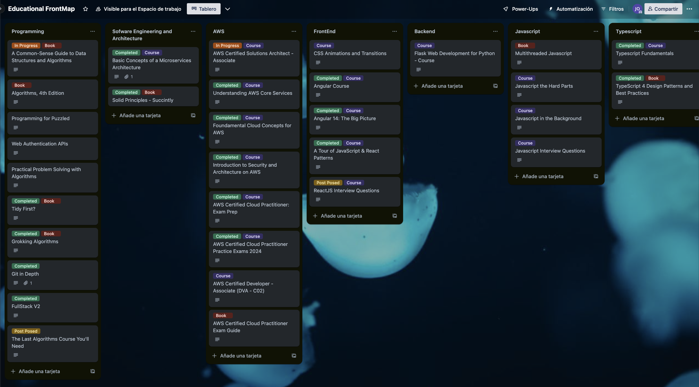
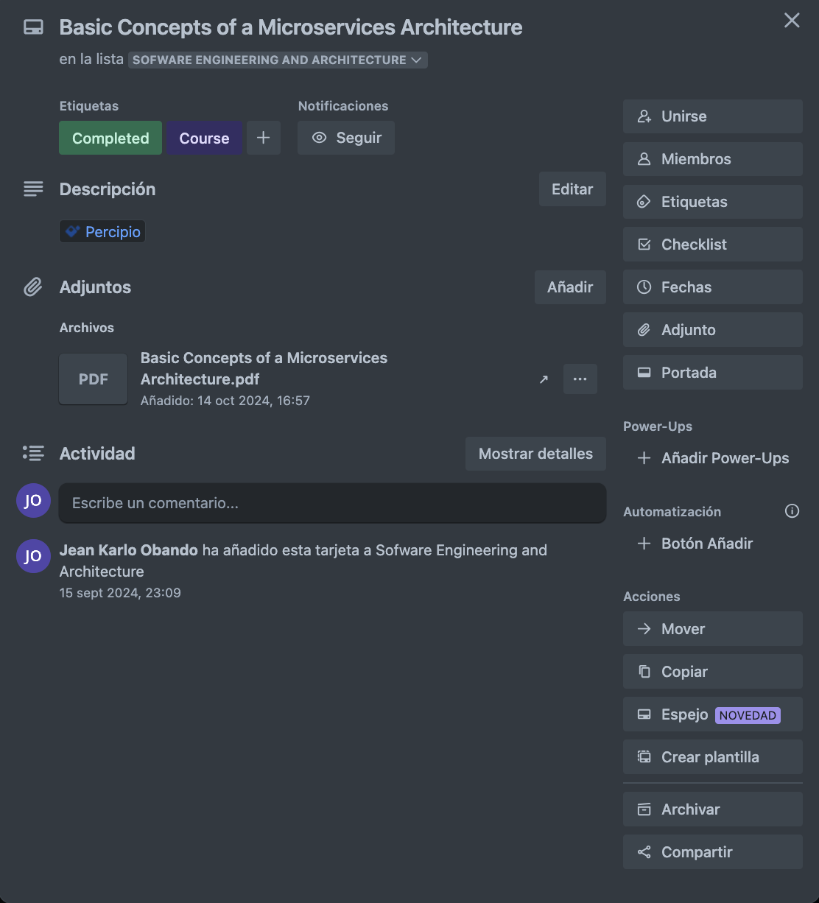

## Tabla de Contenidos

1. [Introducción](#introducción)
2. [¿Qué es un Educational Frontmap?](#qu%c3%a9-es-un-educational-frontmap)
3. [¿Cómo construir un Educational Frontmap?](#c%c3%b3mo-construir-un-educational-frontmap)
4. [Conclusión](#conclusi%c3%b3n)
4. [Recursos](#recursos)

## Introducción:

El entorno actual nos desafía a mantenernos en constante aprendizaje. Cada día aparecen nuevas tecnologías, técnicas o herramientas que nos permiten ser mejor en lo que hacemos y en el proceso disfrutarlo más. Para ello podemos apoyarnos de un sin fin de recursos como: videos de YouTube, libros, cursos, charlas, artículos, entre otros.  

Sin embargo, en este afán de aprender nuevas cosas podemos perder el rumbo y sentirnos abrumados por la cantidad de información que existe. Lo que puede ocasionar que nos frustre no avanzar o no reconocer cada paso que damos en la construcción de nuestra carrera.

Para ello me gustaría presentarles la siguiente herramienta:

## ¿Qué es un Educational Frontmap?

Un "educational frontmap" es un tablero que nos permite organizar y categorizar todos los recursos que hemos utilizado o tenemos interés de explorar. En cada una de estas categorías podemos encontrar cursos, blogs, libros, artículos, videos o personalidades que han contribuido a nuestra formación.

De esta manera podemos contar con un lugar donde se encuentran todos los elementos que han contribuido a nuestra formación y son un espacio para consultas posteriores.

Esta herramienta la encontré hace algunos años leyendo un blog, decidí explorarla e incorporarla en mi vida y me ha dado grandes resultados.  

Permíteme explicarte cómo construir el tuyo.

## ¿Cómo construir un Educational Frontmap?

Como mencioné anteriormente, un "educational frontmap" es un tablero para mapear recursos de aprendizaje. Para ello puedes utilizar herramientas que permitan hacer tablas como: Excel, Notion o Trello.

En cada columna ingresa las áreas de interés que estén relacionadas con tu carrera, en mi caso tengo las siguientes:

- Programming
- Software Engineering and Architecture
- AWS
- Frontend
- Backend
- Javascript / Typescript
- Cloud / DevOps
- Artificial Intelligence
- Others

Como pueden ver las secciones pueden ser muy específicas o generales dependiendo del nivel de profundidad que le quieran dar a cada una de las áreas.

Ahora, para mí también es importante incorporar otras categorías que complementan la formación técnica de un profesional:

- Soft skills.- recursos relacionados con el desarrollo de habilidades no técnicas.
- Pet Projects.- links a proyectos personales
- Inspiration.- personalidades de la industria que tienen una opinión importante
- Research.- investigaciones formales
- Conferences.- ponencias o conferencias en las que se participa como ponente
- Formal Education.- educación formal como pregrados o postgrados.
- Blog Posts.- artículos o blogs de nuestra autoría

Todos estos elementos complementan la formación de un profesional y permiten desarrollar esos elementos diferenciadores dentro de la industria.

Para cada área, agrega los siguientes datos para cada recurso:

- Nombre del recurso (ejemplo: "React Handbook")
- Tipo de recurso (curso, blog, libro, etc.)
- Enlace o ubicación
- Estado (por ejemplo, "en progreso", "pendiente" o "completado")
- Notas personales

Puedes ampliar esta estructura según tus necesidades y personalizarla de acuerdo a tus objetivos de aprendizaje.

## Conclusión:

Un "Educational Frontmap" puede ayudarte a organizar tus objetivos de aprendizaje, mantenerte motivado y facilitar el acceso a los recursos que necesitas. Dedica tiempo a construirlo y personalizarlo para que se convierta en una herramienta clave en tu desarrollo profesional.

Empieza hoy mismo y déjame saber en los comentarios cómo lo has organizado.

## Recursos:

* [Trello](https://trello.com/)
