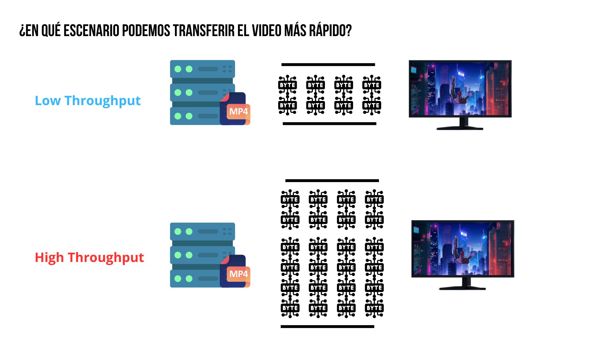
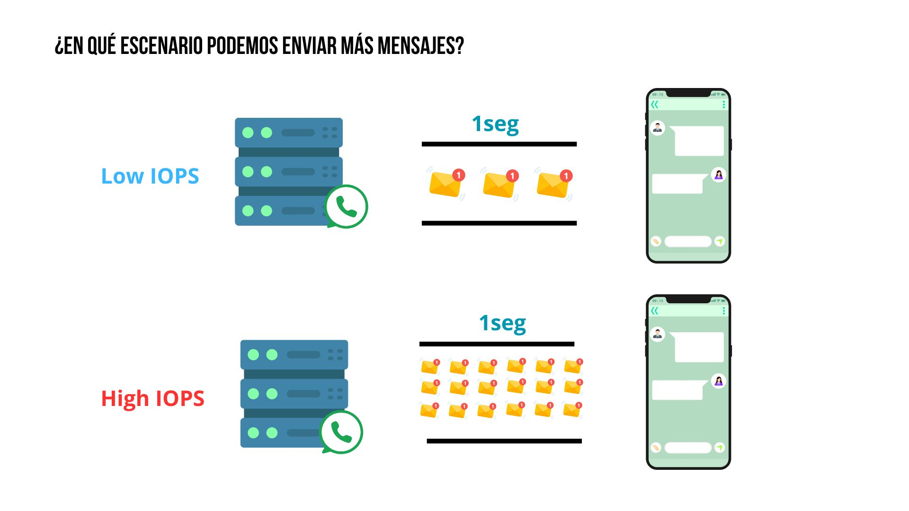

## Tabla de Contenidos

- [Introducción](#introducción)
- [Qué es Throughput?](#qué-es-throughput)
- [Qué es IOPS?](#qué-es-iops)
- [Cómo se relacionan Throughput y el IOPS?](#c%c3%b3mo-se-relacionan-throughput-y-el-iops)
- [Cómo escoger mi servicio AWS de storage en base a estas métricas?](#c%c3%b3mo-escoger-mi-servicio-aws-de-storage-en-base-a-estas-m%c3%a9tricas)
- [Conclusión](#conclusión)
- [Recursos](#recursos)

## Introducción

Uno de los  principales retos que enfrentamos al momento de diseñar soluciones Cloud es seleccionar las herramientas adecuadas para cumplir con nuestro objetivo de manera óptima y eficiente en base a los requerimientos del negocio.

En este blog me gustaría que nos centremos en comprender los conceptos de Throughput y IOPS. Métricas que nos pueden ayudar a seleccionar qué opción de almacenamiento es la más conveniente para nuestro caso.

Comencemos:

## Qué es Throughput?

Imaginemos que somos los encargados de un servicio de streaming de video, como Netflix o YouTube. Cada vez que un usuario reproduce un video, el sistema debe transferir datos constantemente desde el servidor al dispositivo del usuario. Ahora, si millones de usuarios están viendo contenido en alta definición (HD o 4K) al mismo tiempo, la cantidad de datos que debe transferirse es inmensa. Si la capacidad de la red o los servidores no es suficiente para manejar este flujo constante de datos, los usuarios experimentarán interrupciones o tiempos de carga prolongados. Este desafío para transferir **grandes volúmenes de datos de manera continua** es un problema de Throughput.

Throughput se refiere a la cantidad de datos que pueden transferirse en un sistema por unidad de tiempo. Generalmente se mide en megabytes por segundo (MB/s) o gigabytes por segundo (GB/s). Es una métrica clave para evaluar el rendimiento de sistemas que manejan flujos continuos y grandes volúmenes de información.

## Qué es IOPS?

Pensemos en un sistema de mensajería instantánea como WhatsApp o Slack. Cada mensaje que se envía o recibe puede implicar múltiples operaciones pequeñas por segundo. Estas operaciones incluyen almacenar el mensaje en una base de datos, actualizar el estado de lectura y enviar notificaciones a los dispositivos involucrados. Si el sistema no está diseñado para manejar este tipo de carga, podrían ocurrir retrasos en la entrega de mensajes, especialmente cuando millones de usuarios están activos simultáneamente. Esto simboliza un problema de IOPS (Input/Output Per Second).

IOPS se refiere a la cantidad de operaciones de entrada y salida que un sistema puede realizar en un segundo. Estas operaciones pueden incluir lecturas, escrituras o una combinación de ambas. Se mide en operaciones por segundo y es una métrica clave para evaluar el rendimiento de sistemas donde se ejecutan múltiples transacciones rápidas y frecuentes, como bases de datos o sistemas de mensajería.

## Cómo se relacionan Throughput y el IOPS?

Estas dos métricas no son opuestas, más bien nos ayudan a evaluar el rendimiento de nuestros sistemas desde diferentes aristas.  Throughput nos indica la velocidad general a la que los sistemas pueden mover datos. Mientras que IOPS refleja el rendimiento de un sistema con múltiples operaciones rápidas y frecuentes.

Veamoslo con mayor claridad en la siguiente tabla:

| Aspecto         | Throughput | IOPS |
| --------------- | ------------------------------------------------------------------------- | ------------------------------------------------------------------------------------- |
| **Qué mide**    | Cantidad de datos transferidos por unidad de tiempo                       | Número de operaciones de entrada/salida por segundo                                   |
| **Unidad**      | Megabytes por segundo (MB/s) o Gigabytes por segundo (GB/s)               | Operaciones por segundo (número entero)                                               |
| **Importancia** | Crucial para flujos de datos continuos y grandes volúmenes de información | Fundamental en sistemas transaccionales donde se requieren rápidas operaciones de I/O |

## Cómo escoger mi servicio AWS de storage en base a estas métricas?

AWS provee diferentes servicios de almacenamiento y memoria, el seleccionar uno de ellos va a depender mucho de la necesidad de nuestro caso de uso y los requerimientos que tengamos que cumplir. Es por ello analizar las métricas Throughput y el IOPS puede contribuir a que tomemos una mejor decisión. 

La siguiente tabla muestra un resumen de qué servicio está más optimizado para una métrica o la otra.

| Servicio de Almacenamiento | Descripción                                                                                          | Casos de Uso                                                                                       | Optimizado para |
| -------------------------- | ---------------------------------------------------------------------------------------------------- | -------------------------------------------------------------------------------------------------- | --------------- |
| **Amazon S3**              | Almacenamiento de objetos escalable y duradero.                                                      | Respaldo masivo de datos, análisis de Big Data, almacenamiento de contenido multimedia.            | **Throughput**  |
| **Amazon EFS**             | Sistema de archivos compartido para instancias EC2.                                                  | Compartición de archivos entre instancias EC2 en aplicaciones distribuidas o sistemas analíticos.  | **Throughput**  |
| **Amazon EBS**             | Almacenamiento en bloque para instancias EC2.                                                        | Bases de datos transaccionales, aplicaciones críticas con alta concurrencia.                       | **IOPS**        |
| **Amazon FSx for Lustre**  | Diseñado para cargas de trabajo intensivas en datos como análisis y procesamiento de big data.       | Análisis de datos científicos, simulaciones, y cargas de trabajo de machine learning.              | **Throughput**  |
| **Amazon FSx for Windows** | Sistema de archivos optimizado para aplicaciones empresariales y bases de datos en entornos Windows. | Aplicaciones empresariales en Windows, entornos de directorio activo, y bases de datos SQL Server. | **IOPS**        |

## Conclusión

Comprender los requerimientos de nuestros sistemas es importante al momento de seleccionar nuestras soluciones de almacenamiento. El comprender si nuestro sistema requiere mover grandes cantidades de datos (Throughput) o realizar una gran cantidad de operaciones pequeñas por segundo (IOPS) nos permite identificar la métrica correcta para nuestro estudio y la solución de AWS que más se acople a nuestras necesidades.

## Recursos

- [https://buffalotech.com/blog/iops-vs-throughput-what-is-the-difference-and-how-do-they-affect-storage-performance](https://buffalotech.com/blog/iops-vs-throughput-what-is-the-difference-and-how-do-they-affect-storage-performance)
- [https://www.simplyblock.io/blog/iops-throughput-latency-explained/](https://www.simplyblock.io/blog/iops-throughput-latency-explained/)
- [https://silk.us/blog/throughput-vs-iops/](https://silk.us/blog/throughput-vs-iops/)
- [https://www.site24x7.com/learn/linux/iops-throughput.html](https://www.site24x7.com/learn/linux/iops-throughput.html)

